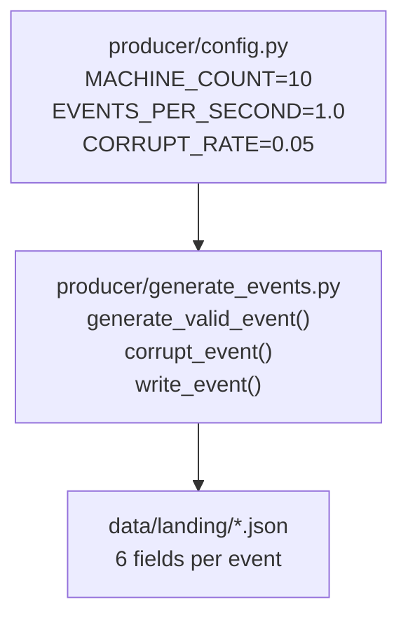
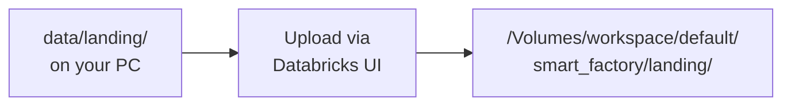
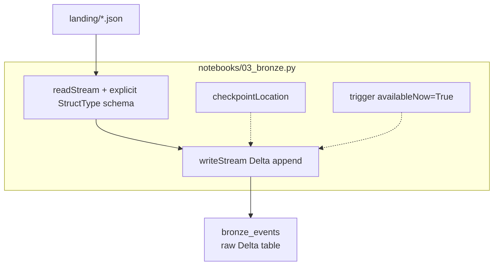
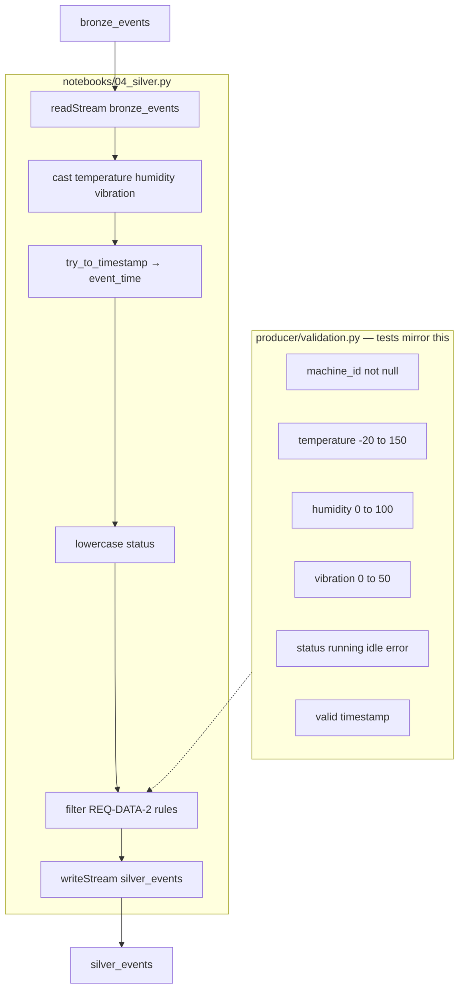
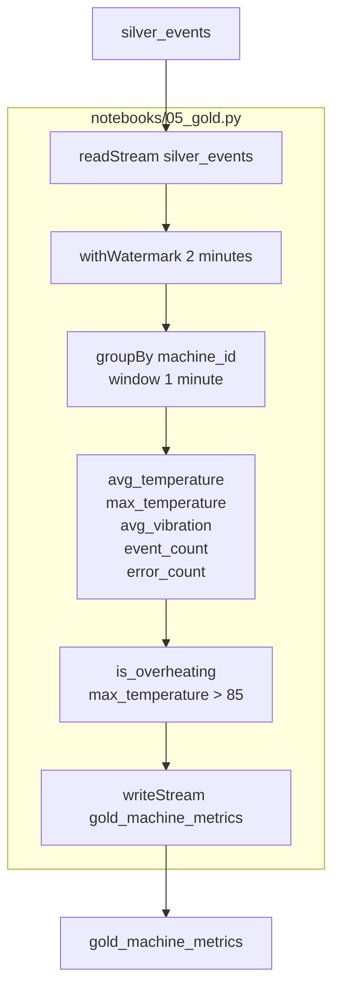
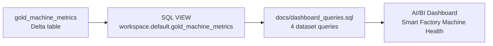
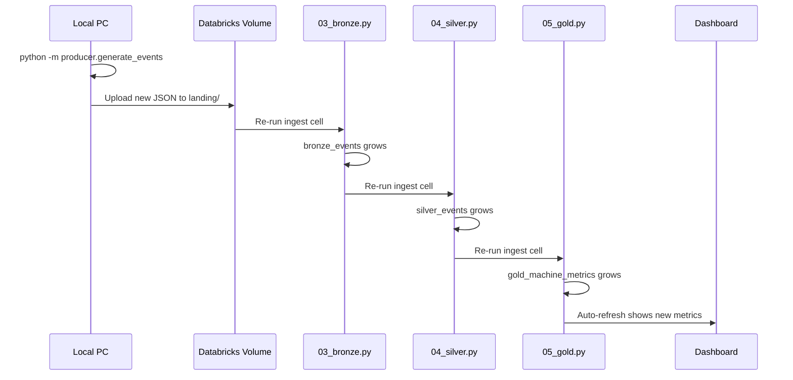
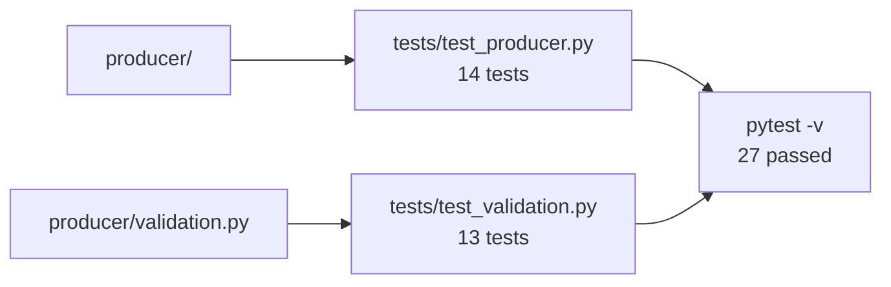

# Smart Factory Streaming Pipeline — Architecture

End-to-end architecture with **what happens at each step**, **which file runs it**, and **where data is stored** (ELT-style).

## Diagram (PNG + SVG)


- **PNG:** [architecture.png](architecture.png)
- **SVG:** [architecture.svg](architecture.svg) (scalable vector)
- **Regenerate:** `python .planning/make_architecture_png.py`

---

## 1. High-level flow (Extract → Load → Transform)

```mermaid
flowchart LR
    subgraph extract [Step 0 — Extract]
        P["producer/generate_events.py"]
        C["producer/config.py"]
    end

    subgraph load_local [Step 1 — Local landing]
        L1["data/landing/*.json"]
    end

    subgraph manual [Step 2 — Upload]
        UP["Manual upload to Databricks volume"]
    end

    subgraph load_cloud [Step 3 — Cloud landing]
        L2["/Volumes/.../landing/"]
    end

    subgraph bronze [Step 4 — Bronze LOAD raw]
        NB["notebooks/03_bronze.py"]
        B["tables/bronze_events"]
        CP1["checkpoints/bronze"]
    end

    subgraph silver [Step 5 — Silver TRANSFORM clean]
        NS["notebooks/04_silver.py"]
        V["producer/validation.py"]
        S["tables/silver_events"]
        CP2["checkpoints/silver"]
    end

    subgraph gold [Step 6 — Gold TRANSFORM metrics]
        NG["notebooks/05_gold.py"]
        G["tables/gold_machine_metrics"]
        CP3["checkpoints/gold"]
    end

    subgraph serve [Step 7 — Serve]
        DQ["docs/dashboard_queries.sql"]
        DB["AI/BI Dashboard"]
    end

    C --> P
    P --> L1
    L1 --> UP
    UP --> L2
    L2 --> NB
    NB --> B
    NB --> CP1
    B --> NS
    V -.-> NS
    NS --> S
    NS --> CP2
    S --> NG
    NG --> G
    NG --> CP3
    G --> DQ
    DQ --> DB
```



---

## 2. Step-by-step: what happens at each stage

### Step 0 — Event generation (Extract)

| | |
|---|---|
| **What happens** | Python simulates 10 factory machines. Each machine emits 1 JSON event/sec with temperature, humidity, vibration, status, timestamp. ~5% events are intentionally corrupt. |
| **Files that run** | `producer/generate_events.py` (main logic), `producer/config.py` (settings) |
| **Command** | `python -m producer.generate_events` |
| **Input** | None (synthetic data) |
| **Output** | One `.json` file per event |
| **Output location** | `data/landing/` (local, gitignored) |
| **Example file** | `data/landing/machine_03_2026-07-07T18-27-50Z_abc123.json` |



**Event schema (REQ-DATA-1):**

```json
{
  "machine_id": "machine_03",
  "temperature": 72.4,
  "humidity": 45.1,
  "vibration": 2.3,
  "status": "running",
  "timestamp": "2026-07-07T15:04:05Z"
}
```

---

### Step 1 — Local landing (staging)

| | |
|---|---|
| **What happens** | JSON files accumulate on your PC. Nothing is sent to cloud automatically. |
| **Files** | `data/landing/*.json` (created by producer) |
| **Purpose** | Local buffer before Databricks ingestion |

---

### Step 2 — Upload to Databricks (bridge)

| | |
|---|---|
| **What happens** | You manually upload JSON files from `data/landing/` to the Unity Catalog volume. |
| **How** | Databricks Catalog → volume `smart_factory` → folder `landing` → Upload |
| **Output location** | `/Volumes/workspace/default/smart_factory/landing/` |
| **Why manual** | Free Edition file-based pipeline; no Kafka/auto-sync in v1 |



---

### Step 3 — Spark basics (optional learning step)

| | |
|---|---|
| **What happens** | Batch read of sample JSON with explicit schema. Practice `select`, `filter`, `groupBy` before streaming. |
| **File** | `notebooks/01_spark_basics.py` |
| **Input** | `/Volumes/.../landing/` |
| **Output** | Console displays only (no Delta table) |
| **Module** | Module 3 |

---

### Step 4 — Bronze layer (Load raw — streaming)

| | |
|---|---|
| **What happens** | `readStream` watches landing folder. Every new JSON file is appended to Bronze Delta **unchanged**. Corrupt rows are kept. Checkpoint tracks progress. |
| **File** | `notebooks/03_bronze.py` |
| **Spark API** | `spark.readStream.schema(...).json()` → `writeStream.format("delta").outputMode("append")` |
| **Trigger** | `availableNow=True` (Free Edition serverless) |
| **Input** | `/Volumes/.../landing/*.json` |
| **Output table** | `/Volumes/.../tables/bronze_events` |
| **Checkpoint** | `/Volumes/.../checkpoints/bronze` |
| **Transform** | **None** — raw ingest only |



**Bronze columns:** `machine_id`, `temperature`, `humidity`, `vibration`, `status`, `timestamp` (same as JSON)

---

### Step 5 — Silver layer (Transform — clean & validate)

| | |
|---|---|
| **What happens** | Stream reads Bronze Delta. Casts types, parses timestamp → `event_time`, lowercases status. Drops rows failing REQ-DATA-2. |
| **Files** | `notebooks/04_silver.py` (Spark streaming), `producer/validation.py` (same rules in Python tests) |
| **Spark API** | `readStream.format("delta")` → `withColumn` / `filter` → `writeStream` |
| **Input** | `bronze_events` |
| **Output table** | `/Volumes/.../tables/silver_events` |
| **Checkpoint** | `/Volumes/.../checkpoints/silver` |
| **Row count** | Silver < Bronze (bad rows removed) |



**Silver columns:** `machine_id`, `temperature`, `humidity`, `vibration`, `status`, `event_time`

---

### Step 6 — Gold layer (Transform — business metrics)

| | |
|---|---|
| **What happens** | Stream reads Silver. Groups by `machine_id` + 1-minute window on `event_time`. Computes averages, counts, overheating flag. 2-minute watermark drops late events. |
| **File** | `notebooks/05_gold.py` |
| **Spark API** | `withWatermark` → `groupBy` + `window` → `agg` → `writeStream` |
| **Input** | `silver_events` |
| **Output table** | `/Volumes/.../tables/gold_machine_metrics` |
| **Checkpoint** | `/Volumes/.../checkpoints/gold` |
| **Output mode** | `append` (Free Edition; SPEC target is `update`) |



**Gold columns:** `machine_id`, `window_start`, `window_end`, `avg_temperature`, `max_temperature`, `avg_vibration`, `event_count`, `error_count`, `is_overheating`

---

### Step 7 — Dashboard (Serve / consume)

| | |
|---|---|
| **What happens** | SQL VIEW over Gold Delta. AI/BI dashboard runs 4 queries as tiles with auto-refresh. |
| **Files** | `docs/dashboard_queries.sql` (SQL definitions), dashboard built in Databricks UI |
| **SQL view** | `workspace.default.gold_machine_metrics` |
| **Tiles** | Avg temperature line · Machines in error · Overheating alerts · Vibration line |



---

## 3. File map — which file does what

| File | Step | Role |
|---|---|---|
| `producer/config.py` | 0 | Machine count, rate, output path, corrupt rate |
| `producer/generate_events.py` | 0 | Create JSON events, write to `data/landing/` |
| `producer/validation.py` | 5 | REQ-DATA-2 rules (used by tests; mirrors Silver) |
| `data/landing/*.json` | 0–1 | Raw event files (local) |
| `/Volumes/.../landing/` | 2–4 | Raw event files (Databricks) |
| `notebooks/01_spark_basics.py` | 3 | Batch PySpark learning (optional) |
| `notebooks/03_bronze.py` | 4 | Bronze streaming ingest |
| `notebooks/04_silver.py` | 5 | Silver clean + validate |
| `notebooks/05_gold.py` | 6 | Gold windowed metrics |
| `docs/dashboard_queries.sql` | 7 | Dashboard SQL + VIEW creation |
| `tests/test_producer.py` | — | Tests producer (Module 2 / 8) |
| `tests/test_validation.py` | — | Tests validation rules (Module 8) |
| `.planning/SPEC.md` | — | Acceptance criteria source of truth |
| `.planning/MASTER_PLAN.md` | — | Learning guide |

---

## 4. Data storage map (Databricks volume)

```text
/Volumes/workspace/default/smart_factory/
│
├── landing/                          ← Step 2–4 input (JSON files)
│   └── machine_01_....json
│
├── tables/
│   ├── bronze_events/                ← Step 4 output (raw Delta)
│   ├── silver_events/                ← Step 5 output (clean Delta)
│   └── gold_machine_metrics/         ← Step 6 output (metrics Delta)
│
└── checkpoints/
    ├── bronze/                       ← Step 4 streaming state
    ├── silver/                       ← Step 5 streaming state
    └── gold/                         ← Step 6 streaming state
```

---

## 5. ELT vs this pipeline

| ELT stage | This project | Layer |
|---|---|---|
| **Extract** | Python producer writes JSON | `producer/` → `data/landing/` |
| **Load** | Bronze ingests raw files to Delta | `notebooks/03_bronze.py` |
| **Transform (clean)** | Silver validates and types data | `notebooks/04_silver.py` |
| **Transform (metrics)** | Gold windowed aggregations | `notebooks/05_gold.py` |
| **Serve** | SQL dashboard | `docs/dashboard_queries.sql` |

---

## 6. Daily run loop



---

## 7. Tests (quality gate)



---

*See also: [README.md](../README.md) · [SPEC.md](SPEC.md) · [MASTER_PLAN.md](MASTER_PLAN.md)*
