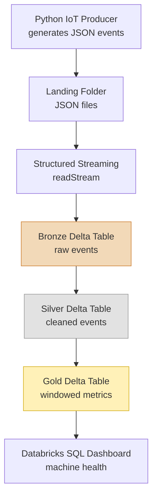
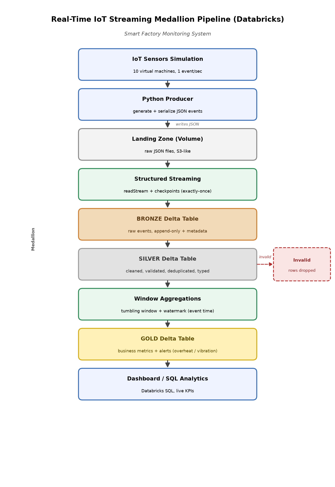

# MASTER PLAN

# Real-Time IoT Streaming Medallion Pipeline using Databricks

> **Scenario:** Smart Factory Monitoring System  
> **Audience:** Beginner Data Engineer (knows batch ETL, new to streaming)  
> **Goal:** Build a simple, portfolio-ready streaming pipeline step by step  
> **Implementation spec:** [SPEC.md](SPEC.md) (spec-driven requirements — what to build)

---

# 1. Project Overview

## Business Problem

A factory has multiple machines with sensors that report **temperature**, **humidity**, **vibration**, and **status** every second.

If a machine overheats or vibrates too much, it can break down and stop production. The factory needs to **see machine health in real time**, not wait for a daily report.

## Why Streaming Is Needed

In batch ETL, you run a job on a schedule (hourly or daily). That works when a few hours of delay is fine.

Here, problems can happen in **seconds**. If you only check data once per hour, you may learn about a failure **too late**.

| Batch | Streaming |
|---|---|
| Runs on a schedule | Runs continuously |
| Answers: "What happened yesterday?" | Answers: "What is happening now?" |
| Good for reports | Good for live monitoring |

**This project uses streaming** because machine health data is only useful if you can act on it quickly.

## What We Will Build

A simple end-to-end pipeline:

1. A **Python script** simulates IoT machine events.
2. **Databricks Structured Streaming** reads the events continuously.
3. Data is stored in **Delta Lake** using **Bronze → Silver → Gold** layers.
4. A **Databricks SQL dashboard** shows live machine health metrics.

**Final result:** A working streaming pipeline you can demo, put on GitHub, and explain in interviews.

---

# 2. Learning Goals

By the end of this project, you should understand:

### Batch vs Streaming
- **Batch:** Process a fixed dataset on a schedule.
- **Streaming:** Process data continuously as it arrives.
- You will see why some use cases need streaming.

### Databricks Basics
- What a Databricks workspace is.
- How to run notebooks and SQL queries.
- How to store and query Delta tables.

### Apache Spark Basics
- Spark is the engine that processes large amounts of data.
- It splits work across partitions and runs transformations in parallel.

### PySpark DataFrames
- A DataFrame is a table-like structure in Spark.
- You will use `select`, `filter`, `withColumn`, and `groupBy` — similar to SQL or pandas.

### Structured Streaming
- Spark's way of treating a live stream like an unbounded table.
- Key ideas: `readStream`, `writeStream`, checkpoints, and triggers.

### Delta Lake
- A storage format on top of Parquet files.
- Gives you reliable writes, schema support, and the ability to read/write streams safely.

### Medallion Architecture
- **Bronze:** Raw data, as received.
- **Silver:** Cleaned and validated data.
- **Gold:** Business metrics and aggregates.
- Each layer has one clear job.

### Streaming Window Aggregations
- Group events into time windows (e.g. per minute).
- Compute averages, counts, and alerts per machine per window.

---

# 3. Technology Stack

| Technology | What it is | Why we use it | Where we use it |
|---|---|---|---|
| **Python** | Programming language | You already know it; good for the producer and tests | `producer/` folder |
| **Databricks Free Edition** | Cloud platform for Spark + Delta | No need to install Spark locally; free to learn | All pipeline notebooks |
| **PySpark** | Python API for Spark | Write Spark code in Python | Bronze, Silver, Gold notebooks |
| **Structured Streaming** | Spark streaming API | Process events continuously | Reading and writing each layer |
| **Delta Lake** | Storage format with a transaction log | Safe, reliable table storage for streaming | Bronze, Silver, Gold tables |
| **SQL** | Query language | Easy way to explore data and build dashboard | Gold queries and dashboard |
| **GitHub** | Version control hosting | Store code and show your work | Entire project repo |

---

# 4. Architecture

## Mermaid Diagram



## High-Level Architecture Diagram (.png)



> A rendered version is saved at `.planning/architecture.png` and `.planning/architecture.svg`. Full ELT step-by-step guide: [ARCHITECTURE.md](ARCHITECTURE.md).

## Simple Data Flow

1. **Producer** writes one JSON event per machine per second to a landing folder.
2. **Structured Streaming** picks up new files and writes them to **Bronze** (raw, unchanged).
3. **Silver** reads Bronze, cleans the data, and drops or fixes bad records.
4. **Gold** reads Silver, groups events into time windows, and calculates metrics.
5. **Dashboard** queries Gold to show temperature, vibration, and alerts live.

---

# 5. Module Plan

Build the modules **in order**. Each module depends on the one before it.

---

## Module 1: Project Setup

**Goal:** Create a clean project folder and GitHub repo.

**Concepts learned:** Git basics, Python virtual environment, project structure.

**Tasks to complete:**
1. Create the GitHub repository.
2. Create the folder structure (see Section 6).
3. Add `requirements.txt`, `.gitignore`, and a basic `README.md`.
4. Create a Python virtual environment and install dependencies.
5. Make the first commit and push to GitHub.

**Expected output:** A working local project and an empty GitHub repo with the correct structure.

---

## Module 2: Python IoT Event Generator

**Goal:** Build a script that simulates factory machine sensor events.

**Concepts learned:** Event schema design, JSON files, controlled random data.

**Tasks to complete:**
1. Create `producer/generate_events.py`.
2. Generate events with: `machine_id`, `temperature`, `humidity`, `vibration`, `status`, `timestamp`.
3. Simulate 5–10 machines sending 1 event per second.
4. Write events as JSON files to a `data/landing/` folder.
5. Add a few bad records on purpose (for Silver testing later).

**Expected output:** A running producer that continuously creates JSON event files.

---

## Module 3: Databricks Setup and Spark Basics

**Goal:** Set up Databricks and learn basic PySpark before streaming.

**Concepts learned:** Databricks workspace, notebooks, DataFrames, basic transforms.

**Tasks to complete:**
1. Create a Databricks Free Edition account.
2. Create a notebook and confirm Spark works (`spark.range(5).show()`).
3. Upload or copy sample JSON from the producer into Databricks.
4. Read the JSON as a **batch** DataFrame and practice `select`, `filter`, `groupBy`.
5. Define an explicit schema for the event fields.

**Expected output:** A notebook that reads sample events and runs basic PySpark operations.

---

## Module 4: Create Bronze Streaming Layer

**Goal:** Ingest raw events into a Bronze Delta table using Structured Streaming.

**Concepts learned:** `readStream`, `writeStream`, checkpoints, append mode.

**Tasks to complete:**
1. Create notebook `notebooks/03_bronze.py`.
2. Use `readStream` to read JSON from the landing folder.
3. Write to a Delta table `bronze_events` in append mode.
4. Set a checkpoint location so the stream can restart safely.
5. Run the producer and confirm rows appear in Bronze.

**Expected output:** A `bronze_events` Delta table that grows as new events arrive.

---

## Module 5: Create Silver Cleaning Layer

**Goal:** Clean and validate Bronze data into a Silver table.

**Concepts learned:** Data validation, type casting, filtering bad rows.

**Tasks to complete:**
1. Create notebook `notebooks/04_silver.py`.
2. Read from `bronze_events` as a stream.
3. Cast fields to correct types (numbers, timestamp).
4. Apply validation rules (see Section 7).
5. Write clean rows to `silver_events` Delta table.
6. Confirm bad records from the producer do not appear in Silver.

**Expected output:** A `silver_events` table with clean, typed, validated data.

---

## Module 6: Create Gold Analytics Layer

**Goal:** Create business metrics from Silver using windowed aggregations.

**Concepts learned:** `groupBy`, window functions, watermarks, aggregations.

**Tasks to complete:**
1. Create notebook `notebooks/05_gold.py`.
2. Read from `silver_events` as a stream.
3. Add a watermark on the event timestamp.
4. Group by `machine_id` and a 1-minute time window.
5. Calculate: `avg_temperature`, `max_temperature`, `avg_vibration`, `event_count`, `error_count`.
6. Add alert flags (e.g. overheating if `max_temperature > 85`).
7. Write results to `gold_machine_metrics` Delta table.

**Expected output:** A `gold_machine_metrics` table with per-machine, per-minute metrics.

---

## Module 7: Create Dashboard

**Goal:** Visualize machine health metrics in Databricks SQL.

**Concepts learned:** SQL queries, dashboard tiles, live data refresh.

**Tasks to complete:**
1. Write SQL queries over `gold_machine_metrics`.
2. Create dashboard tiles:
   - Average temperature per machine (line chart)
   - Machines currently in error (counter or table)
   - Overheating alerts (table)
   - Vibration trend (line chart)
3. Set dashboard to auto-refresh.
4. Run the full pipeline and confirm the dashboard updates live.

**Expected output:** A working Databricks SQL dashboard showing machine health.

---

## Module 8: Testing and Documentation

**Goal:** Make the project portfolio-ready.

**Concepts learned:** Basic testing, README writing, demo preparation.

**Tasks to complete:**
1. Write simple tests for the producer and validation rules.
2. Take screenshots of Bronze, Silver, Gold tables and the dashboard.
3. Finish the `README.md` with: problem, architecture, how to run, screenshots.
4. Commit and push all code to GitHub.
5. Practice explaining the project out loud (see Section 11).

**Expected output:** A complete GitHub repo with tests, docs, and screenshots.

---

# 6. Project Folder Structure

Keep it simple. No enterprise complexity.

```text
smart-factory-streaming-pipeline/
│
├── producer/
│   ├── generate_events.py      # IoT event simulator
│   └── config.py               # machine count, rate, output path
│
├── notebooks/
│   ├── 01_spark_basics.py      # learn PySpark with sample data
│   ├── 03_bronze.py            # Bronze streaming ingestion
│   ├── 04_silver.py            # Silver cleaning
│   └── 05_gold.py              # Gold aggregations
│
├── data/
│   └── landing/                # JSON files from producer (gitignored)
│
├── tests/
│   ├── test_producer.py
│   └── test_validation.py
│
├── docs/
│   ├── dashboard_queries.sql
│   └── screenshots/
│
├── .planning/
│   ├── MASTER_PLAN.md          # Learning and build guide
│   ├── SPEC.md                 # Spec-driven requirements (acceptance criteria per module)
│   ├── ARCHITECTURE.md         # ELT step-by-step + file map
│   ├── architecture.png        # Rendered architecture diagram
│   └── architecture.svg        # Scalable vector diagram
│
├── requirements.txt
├── .gitignore
└── README.md
```

---

# 7. Data Design

## Event Schema

| Field | Type | Example | Notes |
|---|---|---|---|
| `machine_id` | string | `"machine_03"` | Identifies the machine |
| `temperature` | number | `72.4` | Degrees Celsius |
| `humidity` | number | `45.1` | Percentage (0–100) |
| `vibration` | number | `2.3` | Vibration level |
| `status` | string | `"running"` | `running`, `idle`, or `error` |
| `timestamp` | string | `"2026-07-07T15:04:05Z"` | ISO-8601 UTC time |

## Example JSON Event

```json
{
  "machine_id": "machine_03",
  "temperature": 72.4,
  "humidity": 45.1,
  "vibration": 2.3,
  "status": "running",
  "timestamp": "2026-07-07T15:04:05Z"
}
```

## Simple Validation Rules (Silver Layer)

A row is valid only if:

1. `machine_id` is not null.
2. `temperature` is between -20 and 150.
3. `humidity` is between 0 and 100.
4. `vibration` is between 0 and 50.
5. `status` is one of: `running`, `idle`, `error`.
6. `timestamp` can be parsed as a valid datetime.

Invalid rows are dropped in Silver (keep it simple for now).

---

# 8. Medallion Layer Explanation

## Bronze — Raw Data

**What is stored:** Every event exactly as the producer sent it.

**Why:** Bronze is your safety net. If something goes wrong in Silver or Gold, you can always reprocess from Bronze. Nothing is lost or changed here.

**Example columns:** `machine_id`, `temperature`, `humidity`, `vibration`, `status`, `timestamp`

---

## Silver — Cleaned Data

**What cleaning happens:**
- Cast numbers to the correct type.
- Parse `timestamp` into a real timestamp column.
- Remove rows that fail validation rules.
- Keep only trustworthy, typed events.

**Why:** Downstream layers (Gold, dashboard) should only work with clean data.

---

## Gold — Business Metrics

**What business metrics are created (per machine, per 1-minute window):**

| Metric | What it means |
|---|---|
| `avg_temperature` | Average temperature in the window |
| `max_temperature` | Highest temperature in the window |
| `avg_vibration` | Average vibration in the window |
| `event_count` | How many events in the window |
| `error_count` | How many events had `status = error` |
| `is_overheating` | `true` if `max_temperature > 85` |

**Why:** Gold is what the business and dashboard care about — simple, ready-to-use numbers.

---

# 9. Development Order

Build in this exact order. Do not skip ahead.

```
1. Project setup (Module 1)
        ↓
2. Python producer (Module 2)
        ↓
3. Generate sample data locally
        ↓
4. Databricks setup + Spark basics (Module 3)
        ↓
5. Bronze streaming layer (Module 4)  ← needs producer + Databricks
        ↓
6. Silver cleaning layer (Module 5)     ← needs Bronze working
        ↓
7. Gold analytics layer (Module 6)    ← needs Silver working
        ↓
8. Dashboard (Module 7)               ← needs Gold working
        ↓
9. Testing + documentation (Module 8)
```

**Rule:** Confirm each layer works with a simple query before building the next one.

**Daily dev loop once the pipeline is running:**
1. Start the Python producer.
2. Start Bronze → Silver → Gold streaming queries in Databricks.
3. Query Gold or open the dashboard to see live results.

---

# 10. Final Deliverables

At the end of the project, you should have:

- ✅ **Working streaming pipeline** — producer → Bronze → Silver → Gold, running live
- ✅ **GitHub repository** — all code, notebooks, and docs committed
- ✅ **Architecture diagram** — Mermaid in this plan + `.planning/architecture.png` / `.planning/ARCHITECTURE.md`
- ✅ **README** — explains the project and how to run it
- ✅ **Screenshots** — streaming queries, Delta tables, dashboard
- ✅ **Dashboard** — live Databricks SQL dashboard with machine health metrics

---

# 11. Interview Explanation

## 1-Minute Project Explanation

> "I built a real-time IoT streaming pipeline for a smart factory. A Python script simulates machines sending temperature, humidity, vibration, and status every second. I ingest the data into Databricks using Structured Streaming and store it in Delta Lake with a Medallion architecture: Bronze keeps raw events, Silver cleans and validates them, and Gold computes per-minute metrics like average temperature and overheating alerts. A Databricks SQL dashboard shows live machine health. The pipeline uses checkpoints for fault tolerance and watermarks to handle late-arriving data."

## Important Concepts to Explain

| Concept | How to explain it |
|---|---|
| **Batch vs Streaming** | Batch runs on a schedule; streaming processes data continuously. I used streaming because machine failures happen in seconds. |
| **Medallion Architecture** | Bronze = raw, Silver = clean, Gold = business metrics. Each layer has one job and can be tested independently. |
| **Structured Streaming** | Spark treats a live stream like an unbounded table. You use `readStream` and `writeStream` instead of `read` and `write`. |
| **Delta Lake** | Reliable storage for streaming. Supports safe writes and reads at the same time. |
| **Checkpoints** | Save streaming progress so the job can restart without losing or duplicating data. |
| **Watermarks** | Tell Spark how long to wait for late events before closing a time window. |
| **Window Aggregations** | Group events into time buckets (e.g. 1 minute) and compute metrics per bucket. |

---

## Future Improvements (not part of core build)

These are good to mention in interviews as "what I would add next," but **do not build them now**:

- **Databricks Lakeflow Declarative Pipelines (DLT)** — simpler way to define Bronze/Silver/Gold with built-in data quality
- **Kafka** — replace file-based landing with a real message broker
- **Monitoring and alerts** — email/Slack when a machine overheats or the pipeline falls behind
- **CI/CD** — automated deployment with GitHub Actions
- **Microsoft Fabric comparison** — same pipeline using Eventstream + KQL (for learning only)

---

*Build one module at a time. Verify it works. Then move on.*
