# Software Design Document (SDD)

# Smart Factory IoT Streaming Analytics Pipeline

| Field | Value |
|---|---|
| **Document ID** | SDD-SF-001 |
| **Version** | 1.0 |
| **Status** | Approved for Implementation |
| **Date** | 2026-07-09 |
| **Author** | Data Engineering Team |
| **Reviewers** | Senior Data Engineering Architect (pending) |
| **Related Documents** | [SPEC.md](SPEC.md) · [ARCHITECTURE.md](ARCHITECTURE.md) · [MASTER_PLAN.md](MASTER_PLAN.md) |
| **Methodology** | Spec-Driven Development (design before implementation) |

---

## Document Control

| Version | Date | Author | Summary |
|---|---|---|---|
| 1.0 | 2026-07-09 | Data Engineering Team | Initial complete SDD for architecture review |

### Approval Sign-Off

| Role | Name | Signature | Date |
|---|---|---|---|
| Data Engineering Lead | _TBD_ | | |
| Senior Architect | _TBD_ | | |
| Product Owner | _TBD_ | | |

### Audience

| Audience | Purpose |
|---|---|
| Beginner Data Engineers | Implementation guide and learning reference |
| Senior Architects | Design review, risk assessment, pattern validation |
| Hiring Managers / Interviewers | Portfolio artifact demonstrating production-inspired thinking |
| Future Maintainers | Onboarding and extension reference |

---

## Table of Contents

1. [Project Overview](#1-project-overview)
2. [Business Problem](#2-business-problem)
3. [Business Goals](#3-business-goals)
4. [Scope](#4-scope)
5. [Out of Scope](#5-out-of-scope)
6. [Functional Requirements](#6-functional-requirements)
7. [Non-Functional Requirements](#7-non-functional-requirements)
8. [Complete End-to-End Architecture](#8-complete-end-to-end-architecture)
9. [Streaming Data Flow](#9-streaming-data-flow)
10. [Medallion Architecture Design](#10-medallion-architecture-design)
11. [Detailed Notebook Responsibilities](#11-detailed-notebook-responsibilities)
12. [Folder Structure](#12-folder-structure)
13. [Databricks Workspace Structure](#13-databricks-workspace-structure)
14. [Landing Volume Design](#14-landing-volume-design)
15. [Bronze Layer Design](#15-bronze-layer-design)
16. [Silver Layer Design](#16-silver-layer-design)
17. [Gold Layer Design](#17-gold-layer-design)
18. [Streaming Query Flow](#18-streaming-query-flow)
19. [Event Lifecycle](#19-event-lifecycle)
20. [Checkpoint Strategy](#20-checkpoint-strategy)
21. [Delta Table Design](#21-delta-table-design)
22. [Streaming Trigger Strategy](#22-streaming-trigger-strategy)
23. [Watermark Strategy](#23-watermark-strategy)
24. [Window Aggregation Strategy](#24-window-aggregation-strategy)
25. [Data Quality Rules](#25-data-quality-rules)
26. [IoT Event Schema](#26-iot-event-schema)
27. [Data Dictionary](#27-data-dictionary)
28. [Business Metrics](#28-business-metrics)
29. [Dashboard Layout](#29-dashboard-layout)
30. [Error Handling Strategy](#30-error-handling-strategy)
31. [Logging Strategy](#31-logging-strategy)
32. [Monitoring Strategy](#32-monitoring-strategy)
33. [Testing Strategy](#33-testing-strategy)
34. [Acceptance Criteria](#34-acceptance-criteria)
35. [Project Milestones](#35-project-milestones)
36. [Module-by-Module Development Plan](#36-module-by-module-development-plan)
37. [Future Improvements](#37-future-improvements)
38. [README Outline](#38-readme-outline)
39. [GitHub Repository Structure](#39-github-repository-structure)
40. [Demo Walkthrough](#40-demo-walkthrough)

---

## 1. Project Overview

### 1.1 Summary

The **Smart Factory IoT Streaming Analytics Pipeline** is a portfolio-quality, end-to-end real-time data engineering project built entirely on **Databricks Free Edition**. It simulates a manufacturing environment where multiple factory machines emit continuous IoT sensor readings. Those readings flow through a **Medallion Architecture** (Bronze → Silver → Gold) powered by **Apache Spark Structured Streaming** and **Delta Lake**, culminating in a **Databricks SQL / AI-BI Dashboard** for live machine health monitoring.

### 1.2 Problem Statement (One Sentence)

Factory operators need to detect overheating, excessive vibration, and machine errors within seconds—not hours—so they can intervene before production stops.

### 1.3 Solution Statement (One Sentence)

A spec-driven, notebook-based streaming pipeline ingests simulated IoT events into Delta Lake layers, cleans and validates them, computes per-minute machine health metrics with windowed aggregations, and surfaces alerts on a live dashboard.

### 1.4 Key Design Principles

| Principle | Description |
|---|---|
| **Spec-first** | All requirements, schemas, and acceptance criteria are defined before any notebook implementation |
| **Beginner-accessible** | Concepts are explained plainly; complexity is introduced incrementally across modules |
| **Production-inspired** | Patterns mirror real pipelines: medallion layers, checkpoints, watermarks, explicit schemas, data contracts |
| **Databricks-native** | All pipeline logic runs in Databricks notebooks; GitHub is version control only |
| **Free Edition compatible** | Design explicitly accounts for serverless trigger and output-mode constraints |
| **Observable by design** | Row counts, validation drops, and dashboard tiles provide end-to-end traceability |

### 1.5 Technology Summary

| Layer | Technology |
|---|---|
| Compute | Databricks Free Edition (Serverless) |
| Language | Python (notebooks + local test harness) |
| Processing | PySpark, Structured Streaming |
| Storage | Delta Lake on Unity Catalog Volumes |
| Governance | Unity Catalog (catalog `workspace`, schema `default`) |
| Consumption | Databricks SQL, AI/BI Dashboard |
| Version Control | GitHub |

---

## 2. Business Problem

### 2.1 Context

A manufacturing company operates **10 factory machines** (configurable), each equipped with sensors measuring:

- **Temperature** — overheating risk
- **Humidity** — environmental conditions
- **Vibration** — mechanical wear / imminent failure
- **Status** — operational state (`running`, `idle`, `error`)

Each machine emits **one event per second**. At this velocity, a single machine produces **3,600 events per hour**. Across 10 machines, that is **36,000 events per hour**—too fast and too continuous for a nightly batch report to be operationally useful.

### 2.2 Pain Points

| Pain Point | Impact | Current State (Before Pipeline) |
|---|---|---|
| Delayed visibility | Machines fail before operators notice | Daily or hourly batch reports |
| No unified view | Siloed sensor logs per machine | Disconnected log files |
| Data quality unknown | Bad readings skew analytics | No validation layer |
| No alerting | Overheating goes undetected | Manual floor checks |
| No audit trail | Cannot replay or investigate incidents | Raw files overwritten or lost |

### 2.3 Why Streaming (Not Batch)

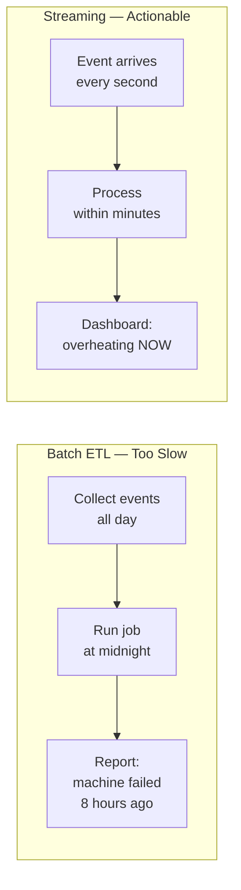

| Dimension | Batch | Streaming (This Project) |
|---|---|---|
| Latency | Hours to days | Seconds to minutes |
| Question answered | "What happened yesterday?" | "What is happening now?" |
| Failure detection | After the fact | Near real-time |
| Fit for IoT sensors | Poor | Strong |

### 2.4 Stakeholders

| Stakeholder | Interest |
|---|---|
| Factory Operator | Live dashboard, overheating and error alerts |
| Maintenance Engineer | Vibration trends, error frequency per machine |
| Data Engineer | Reliable ingest, clean layers, fault-tolerant streaming |
| Engineering Manager | Uptime metrics, portfolio demonstration of capability |

---

## 3. Business Goals

### 3.1 Primary Goals

| ID | Goal | Success Indicator |
|---|---|---|
| BG-1 | Ingest all IoT events without loss | Bronze row count grows monotonically; checkpoint resume works |
| BG-2 | Deliver trustworthy analytics data | Silver contains only validated events; zero nulls in required columns |
| BG-3 | Enable near-real-time machine health monitoring | Gold metrics update within minutes of new events |
| BG-4 | Surface actionable alerts | Dashboard shows overheating and error tiles that update live |
| BG-5 | Demonstrate production-grade patterns | Medallion, checkpoints, watermarks, explicit schemas documented and working |

### 3.2 Secondary Goals

| ID | Goal | Success Indicator |
|---|---|---|
| BG-6 | Portfolio readiness | README, screenshots, GitHub repo, interview-ready narrative |
| BG-7 | Learning outcomes | Builder can explain batch vs streaming, medallion layers, and window aggregations |
| BG-8 | Reproducibility | Another developer can run the pipeline from documentation alone |

### 3.3 Key Performance Indicators (Portfolio / Demo Context)

| KPI | Target | Measurement |
|---|---|---|
| Ingest completeness | 100% of landing files reflected in Bronze | Compare landing file count vs Bronze delta |
| Data quality pass rate | ~95% (given 5% corrupt injection) | Silver rows / Bronze rows |
| End-to-end latency (demo) | < 5 minutes from upload to dashboard | Manual timestamp comparison |
| Dashboard refresh | Auto-refresh while pipeline runs | Visual observation |
| Test pass rate | 100% | `pytest` green |

---

## 4. Scope

### 4.1 In Scope

| Area | Details |
|---|---|
| **Event simulation** | Python-based IoT producer (Databricks notebook primary; local script acceptable for dev/testing) |
| **Landing zone** | Unity Catalog Volume folder for raw JSON files |
| **Bronze layer** | Structured Streaming ingest of raw JSON → Delta table (unchanged) |
| **Silver layer** | Streaming clean, cast, validate → Delta table |
| **Gold layer** | Streaming windowed aggregations → Delta table |
| **Dashboard** | Databricks SQL / AI-BI Dashboard with 4 visualization tiles |
| **Data contracts** | REQ-DATA-1 schema, REQ-DATA-2 validation rules |
| **Fault tolerance** | Per-layer checkpoint directories |
| **Late data handling** | 2-minute watermark on Gold layer |
| **Documentation** | SDD, SPEC, ARCHITECTURE, README, screenshots |
| **Unit tests** | Producer and validation rule tests (local pytest) |
| **Version control** | GitHub repository with medallion notebook sources |

### 4.2 System Boundary

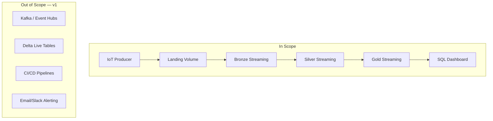

### 4.3 Assumptions

| ID | Assumption |
|---|---|
| A-1 | Databricks Free Edition workspace is available with Unity Catalog Volumes enabled |
| A-4 | User has GitHub account for version control |
| A-5 | Demo runs use 10 machines at 1 event/sec—a manageable volume for Free Edition |
| A-6 | Manual or notebook-based upload to landing volume is acceptable in v1 (no Kafka) |
| A-7 | Portfolio/demo context tolerates minutes-level latency rather than sub-second SLA |

### 4.4 Constraints

| ID | Constraint | Design Impact |
|---|---|---|
| C-1 | Databricks Free Edition only | Use `trigger(availableNow=True)` instead of continuous `processingTime` on serverless |
| C-2 | No paid features | No DLT, no Auto Loader, no advanced monitoring |
| C-3 | Implementation in notebooks only | No IDE-based Spark development for pipeline logic |
| C-4 | GitHub for version control only | Notebooks synced/imported to Databricks workspace |
| C-5 | Beginner-friendly | One responsibility per notebook; heavy comments in learning modules |

---

## 5. Out of Scope

The following are **explicitly excluded** from version 1.0. They are documented in [Future Improvements](#37-future-improvements).

| Item | Reason for Exclusion |
|---|---|
| Apache Kafka / Azure Event Hubs / AWS Kinesis | Adds infrastructure complexity; file-based landing sufficient for learning |
| Databricks Lakeflow Declarative Pipelines (DLT) | Paid/advanced feature; notebooks teach fundamentals better |
| Auto Loader (`cloudFiles`) | Not required for volume-based JSON ingest in v1 |
| Dead-letter / quarantine table | Silver filter is sufficient; quarantine is a v2 enhancement |
| CI/CD with GitHub Actions | Out of portfolio scope for Free Edition |
| Email, Slack, PagerDuty alerting | Dashboard-only alerting in v1 |
| Microsoft Fabric comparison build | Different platform; noted as future extension |
| Multi-workspace deployment | Single workspace demo |
| Role-based access control (fine-grained) | Default workspace permissions sufficient |
| ML-based anomaly detection | Rule-based `is_overheating` flag sufficient for v1 |
| Historical backfill orchestration | Manual re-run of streaming notebooks acceptable |

---

## 6. Functional Requirements

Functional requirements are organized by module. Full acceptance criteria appear in [Section 34](#34-acceptance-criteria) and [SPEC.md](SPEC.md).

### 6.1 Requirement Summary Matrix

| Req ID | Module | Requirement | Priority |
|---|---|---|---|
| FR-1 | Setup | Provide standard repo folder structure and dependencies | Must |
| FR-2 | Producer | Generate realistic IoT JSON events at configurable rate | Must |
| FR-3 | Producer | Inject ~5% corrupt events for Silver testing | Must |
| FR-4 | Spark Basics | Demonstrate batch PySpark with explicit schema | Should |
| FR-5 | Bronze | Stream-ingest raw JSON to Delta without transformation | Must |
| FR-6 | Bronze | Persist corrupt events (no filtering) | Must |
| FR-7 | Silver | Cast, parse, normalize, and validate Bronze stream | Must |
| FR-8 | Silver | Exclude events failing REQ-DATA-2 | Must |
| FR-9 | Gold | Compute 1-minute windowed metrics per machine | Must |
| FR-10 | Gold | Flag overheating when max temperature > 85°C | Must |
| FR-11 | Gold | Apply 2-minute watermark for late events | Must |
| FR-12 | Dashboard | Display 4 tiles: temperature, errors, overheating, vibration | Must |
| FR-13 | Testing | Unit tests for producer and validation rules | Must |
| FR-14 | Docs | README, screenshots, architecture documentation | Must |

### 6.2 Shared Data Contract Requirements

| Req ID | Name | Description |
|---|---|---|
| REQ-DATA-1 | Event Schema | Six fields: `machine_id`, `temperature`, `humidity`, `vibration`, `status`, `timestamp` |
| REQ-DATA-2 | Validation Rules | Six rules governing valid events (see [Section 25](#25-data-quality-rules)) |

### 6.3 Producer Functional Requirements

| Req ID | Behavior |
|---|---|
| FR-P-1 | Emit one event per machine per second (configurable) |
| FR-P-2 | Write each event as a separate JSON file to landing |
| FR-P-3 | Use current UTC ISO-8601 timestamp |
| FR-P-4 | Support machine IDs `machine_01` through `machine_NN` |
| FR-P-5 | Stop gracefully on user interrupt without corrupting last file |
| FR-P-6 | Log event count at regular intervals |

### 6.4 Streaming Layer Functional Requirements

| Layer | Input | Output | Transform |
|---|---|---|---|
| Bronze | Landing JSON files | `bronze_events` Delta | None (raw ingest) |
| Silver | `bronze_events` stream | `silver_events` Delta | Cast, parse, validate, filter |
| Gold | `silver_events` stream | `gold_machine_metrics` Delta | Watermark, window, aggregate |

### 6.5 Dashboard Functional Requirements

| Req ID | Visualization | Data Source |
|---|---|---|
| FR-D-1 | Line chart: avg temperature per machine over time | `gold_machine_metrics` |
| FR-D-2 | Table/counter: machines currently in error | `gold_machine_metrics` |
| FR-D-3 | Table: overheating alerts | `gold_machine_metrics` WHERE `is_overheating` |
| FR-D-4 | Line chart: avg vibration per machine over time | `gold_machine_metrics` |
| FR-D-5 | Auto-refresh while pipeline is active | Dashboard setting |

---

## 7. Non-Functional Requirements

### 7.1 NFR Summary

| ID | Category | Requirement | Target |
|---|---|---|---|
| NFR-1 | Simplicity | Run on Databricks Free Edition without paid features | 100% Free Edition |
| NFR-2 | Fault Tolerance | Checkpoints enable restart without loss or duplication | Verified by restart test |
| NFR-3 | Reproducibility | Runnable from README instructions alone | Independent developer test |
| NFR-4 | Scope Discipline | No Kafka, DLT, CI/CD in v1 | Enforced by spec |
| NFR-5 | Maintainability | One clear responsibility per notebook | Architecture review |
| NFR-6 | Observability | Row counts and validation drops are inspectable | SQL `COUNT(*)` queries |
| NFR-7 | Data Integrity | Bronze is append-only; Silver/Gold are deterministic transforms | Re-run produces consistent Silver/Gold |
| NFR-8 | Portability | Notebook paths parameterized at top of each notebook | Single constant block |
| NFR-9 | Documentation Quality | SDD + SPEC + ARCHITECTURE before implementation | This document |
| NFR-10 | Performance (demo) | Handle 10 events/sec sustained | Free Edition serverless |

### 7.2 Free Edition Adaptations

| Design Target (Production) | Free Edition Adaptation | Rationale |
|---|---|---|
| `trigger(processingTime='10 seconds')` | `trigger(availableNow=True)` | Serverless clusters process all available data then stop |
| Gold `outputMode('update')` | Gold `outputMode('append')` | Compatibility with available streaming sink modes |
| Continuous streaming job | Re-run ingest cell on demand | Manual trigger acceptable for demo |
| `CREATE TABLE` on volume path | `CREATE VIEW` over Delta path | Unity Catalog volume table registration limitation |

### 7.3 Security & Governance (v1 Minimal)

| Concern | v1 Approach |
|---|---|
| Authentication | Databricks workspace login |
| Authorization | Default workspace permissions |
| Secrets | None required (synthetic data, no external APIs) |
| PII | None (synthetic machine data) |
| Encryption | Platform-managed (Databricks) |

---

## 8. Complete End-to-End Architecture

### 8.1 Architecture Diagram

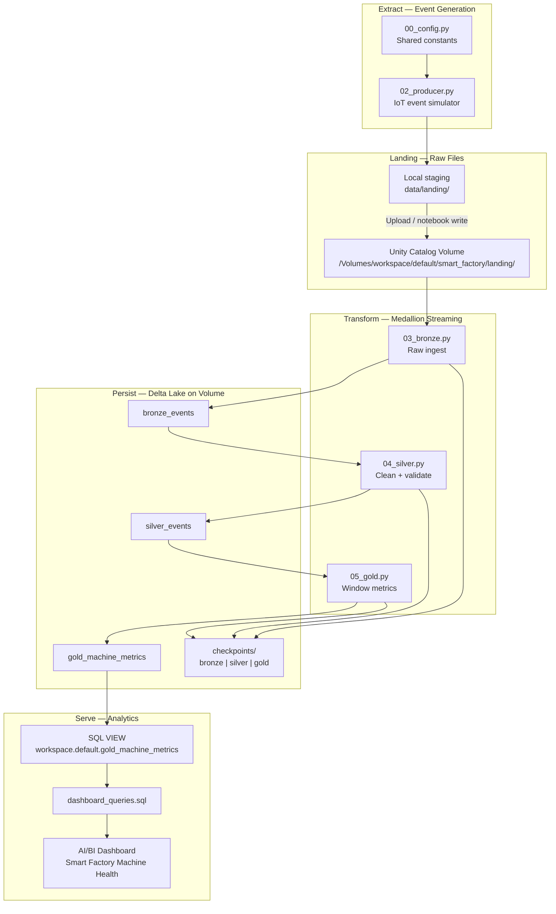

### 8.2 Layer Responsibilities

| Layer | Responsibility | Data State | Consumer |
|---|---|---|---|
| Landing | Buffer raw JSON files | Unprocessed files | Bronze notebook |
| Bronze | Immutable raw ingest | Append-only Delta | Silver notebook, auditors |
| Silver | Conformed, validated events | Clean Delta | Gold notebook, ad-hoc SQL |
| Gold | Business metrics & KPIs | Aggregated Delta | Dashboard, analysts |
| Dashboard | Human-readable monitoring | Query results | Factory operators |

### 8.3 Component Inventory

| Component | Type | Location | Lifecycle |
|---|---|---|---|
| IoT Producer | Databricks notebook | `notebooks/02_producer.py` | Run on demand or scheduled |
| Spark Basics | Learning notebook | `notebooks/01_spark_basics.py` | Run once during onboarding |
| Bronze Ingest | Streaming notebook | `notebooks/03_bronze.py` | Re-run when new landing files arrive |
| Silver Clean | Streaming notebook | `notebooks/04_silver.py` | Re-run after Bronze completes |
| Gold Metrics | Streaming notebook | `notebooks/05_gold.py` | Re-run after Silver completes |
| Dashboard | AI/BI artifact | Databricks UI | Persistent; auto-refresh |
| Validation rules | Shared Python module | `producer/validation.py` | Imported by tests; mirrored in Silver |

### 8.4 Deployment Topology

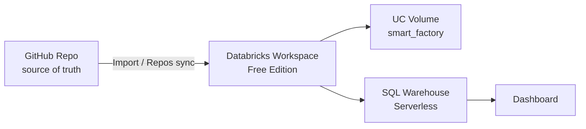

| Environment | Purpose | Notes |
|---|---|---|
| Local (dev only) | pytest, optional local producer | Not part of production path |
| Databricks Workspace | All pipeline execution | Primary runtime |
| GitHub | Version control | Notebooks committed as `.py` source format |

---

## 9. Streaming Data Flow

### 9.1 End-to-End Data Flow

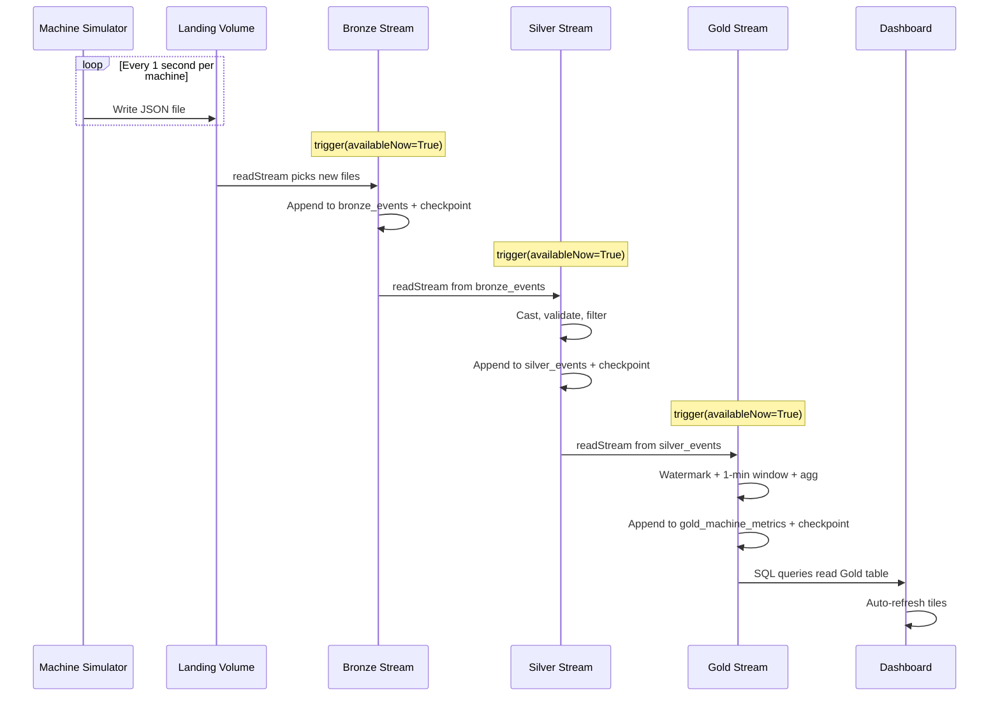

### 9.2 Data Flow Stages

| Stage | Format | Granularity | Mutability |
|---|---|---|---|
| 1 — Event creation | JSON file | 1 event / file | Immutable once written |
| 2 — Landing | JSON on Volume | 1 file / event | Append-only (files added) |
| 3 — Bronze | Delta table | 1 row / event | Append-only |
| 4 — Silver | Delta table | 1 row / valid event | Append-only |
| 5 — Gold | Delta table | 1 row / machine / minute | Append (v1) |
| 6 — Dashboard | Query result set | Aggregated view | Read-only |

### 9.3 Throughput Estimates (Default Config)

| Metric | Value |
|---|---|
| Machines | 10 |
| Events per machine per second | 1 |
| Total events per second | 10 |
| JSON files per minute | 600 |
| Bronze rows per hour | 36,000 |
| Expected Silver rows per hour | ~34,200 (95% pass rate) |
| Gold rows per hour (max) | ~600 (10 machines × 60 minutes) |

### 9.4 File Naming Convention (Landing)

| Element | Pattern | Example |
|---|---|---|
| Machine ID | `machine_{NN}` | `machine_03` |
| Timestamp | ISO-8601 UTC, file-safe | `2026-07-07T18-27-45Z` |
| Unique suffix | Short UUID | `696f6822` |
| Full filename | `{machine_id}_{timestamp}_{uuid}.json` | `machine_03_2026-07-07T18-27-45Z_696f6822.json` |

---

## 10. Medallion Architecture Design

### 10.1 Medallion Overview

The **Medallion Architecture** organizes data into three quality tiers. Each tier has a single, well-defined purpose. Data flows in one direction: Bronze → Silver → Gold.

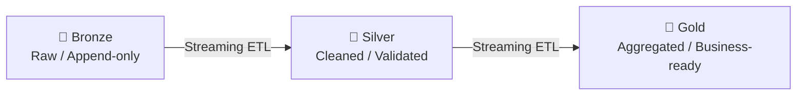

### 10.2 Layer Comparison

| Attribute | Bronze | Silver | Gold |
|---|---|---|---|
| **Purpose** | Raw archival ingest | Data quality & conformation | Analytics & KPIs |
| **Schema** | As-received (6 fields) | Typed + `event_time` | Windowed metrics (9 fields) |
| **Transformations** | None | Cast, parse, filter | Watermark, window, aggregate |
| **Bad data** | Retained | Filtered out | Never seen (filtered upstream) |
| **Source** | Landing JSON files | Bronze Delta | Silver Delta |
| **Sink mode** | Append | Append | Append (v1) |
| **Replayable** | Yes (from landing) | Yes (from Bronze) | Yes (from Silver) |
| **Primary user** | Data engineer | Data engineer / analyst | Analyst / operator |

### 10.3 ELT Mapping

| ELT Phase | Medallion Layer | Notebook |
|---|---|---|
| **Extract** | Landing (pre-Bronze) | `02_producer.py` |
| **Load** | Bronze | `03_bronze.py` |
| **Transform (clean)** | Silver | `04_silver.py` |
| **Transform (aggregate)** | Gold | `05_gold.py` |
| **Serve** | Dashboard | SQL + AI/BI UI |

### 10.4 Design Rationale

| Decision | Rationale |
|---|---|
| Separate Bronze and Silver | Preserves raw data for audit; quality failures don't destroy evidence |
| Streaming between layers | Consistent processing model; teaches Structured Streaming end-to-end |
| Gold as aggregated table | Dashboard queries are fast and simple (pre-computed metrics) |
| No Silver → Gold skip | Enforces layered quality; Gold never sees unvalidated data |

---

## 11. Detailed Notebook Responsibilities

### 11.1 Notebook Catalog

| Notebook | Module | Primary Responsibility | Depends On |
|---|---|---|---|
| `00_config.py` | Shared | Central path constants and schema definitions | Volume created |
| `01_spark_basics.py` | 3 | Batch PySpark learning with explicit schema | Sample landing data |
| `02_producer.py` | 2 | Generate and write IoT JSON events to landing volume | `00_config.py` |
| `03_bronze.py` | 4 | Stream-ingest landing JSON → Bronze Delta | Landing files exist |
| `04_silver.py` | 5 | Stream-transform Bronze → validated Silver Delta | Bronze table has rows |
| `05_gold.py` | 6 | Stream-aggregate Silver → Gold metrics Delta | Silver table has rows |
| `06_dashboard_setup.sql` | 7 | Create VIEW and document dashboard queries | Gold table has rows |

### 11.2 Per-Notebook Cell Structure (Design Pattern)

Each pipeline notebook (`03`–`05`) follows a consistent cell layout:

| Cell # | Purpose | Contents |
|---|---|---|
| 1 | Header | Module name, description, links to SPEC acceptance criteria |
| 2 | Configuration | Volume paths, checkpoint paths, table paths (from `00_config` or inline) |
| 3 | Read stream | `readStream` with explicit schema (Bronze) or Delta format (Silver/Gold) |
| 4 | Transform | Layer-specific logic (none / clean / aggregate) |
| 5 | Write stream | `writeStream` with format, output mode, checkpoint, trigger |
| 6 | Verify | Display row count, `display()` sample, schema print |
| 7 | Notes | Operational instructions (when to re-run, what to expect) |

### 11.3 Notebook Responsibility Matrix

| Concern | 01 | 02 | 03 | 04 | 05 |
|---|---|---|---|---|---|
| Explicit schema definition | ✓ | | ✓ | | |
| `readStream` | | | ✓ | ✓ | ✓ |
| `writeStream` | | | ✓ | ✓ | ✓ |
| Checkpoint | | | ✓ | ✓ | ✓ |
| Data quality filter | | | | ✓ | |
| Watermark | | | | | ✓ |
| Window aggregation | | | ✓ (batch demo) | | ✓ |
| Corrupt event injection | | ✓ | | | |
| Dashboard prep | | | | | |

### 11.4 `00_config.py` — Shared Configuration

| Constant | Purpose | Example Value |
|---|---|---|
| `VOLUME_BASE` | Root volume path | `/Volumes/workspace/default/smart_factory` |
| `LANDING_PATH` | JSON landing folder | `{VOLUME_BASE}/landing` |
| `BRONZE_TABLE_PATH` | Bronze Delta location | `{VOLUME_BASE}/tables/bronze_events` |
| `SILVER_TABLE_PATH` | Silver Delta location | `{VOLUME_BASE}/tables/silver_events` |
| `GOLD_TABLE_PATH` | Gold Delta location | `{VOLUME_BASE}/tables/gold_machine_metrics` |
| `CHECKPOINT_BASE` | Checkpoint root | `{VOLUME_BASE}/checkpoints` |
| `MACHINE_COUNT` | Producer setting | `10` |
| `EVENTS_PER_SECOND` | Producer rate | `1.0` |
| `CORRUPT_RATE` | Bad data injection rate | `0.05` |

---

## 12. Folder Structure

### 12.1 GitHub Repository Layout

```text
smart-factory-streaming-pipeline/
│
├── .planning/                      # Design documents (pre-implementation)
│   ├── SDD.md                      # This document
│   ├── SPEC.md                     # Acceptance criteria
│   ├── ARCHITECTURE.md             # Step-by-step architecture guide
│   ├── MASTER_PLAN.md              # Learning walkthrough
│   ├── architecture.png            # Rendered diagram
│   └── architecture.svg            # Scalable diagram source
│
├── producer/                       # Shared Python modules (tests + validation)
│   ├── config.py                   # Producer configuration defaults
│   ├── generate_events.py          # Event generation logic (reference)
│   └── validation.py               # REQ-DATA-2 rules (test mirror)
│
├── notebooks/                      # Databricks notebooks (primary implementation)
│   ├── 00_config.py                # Shared path/schema constants
│   ├── 01_spark_basics.py          # Module 3 — batch learning
│   ├── 02_producer.py              # Module 2 — IoT simulator (Databricks)
│   ├── 03_bronze.py                # Module 4 — Bronze streaming
│   ├── 04_silver.py                # Module 5 — Silver streaming
│   └── 05_gold.py                  # Module 6 — Gold streaming
│
├── docs/
│   ├── dashboard_queries.sql       # SQL for VIEW + 4 dashboard datasets
│   └── screenshots/                  # Portfolio images
│       └── README.md                 # Screenshot capture instructions
│
├── tests/
│   ├── test_producer.py            # Producer unit tests
│   └── test_validation.py          # Validation rule tests
│
├── data/
│   └── landing/                    # Local staging (gitignored)
│
├── .gitignore
├── requirements.txt                # Local test dependencies
└── README.md                       # Project entry point
```

### 12.2 Folder Purpose Table

| Folder | Purpose | Committed to Git |
|---|---|---|
| `.planning/` | Architecture and specification artifacts | Yes |
| `notebooks/` | Databricks notebook source (`.py` format) | Yes |
| `producer/` | Validation rules and producer reference logic | Yes |
| `docs/` | SQL queries, screenshots | Yes (not large binary data) |
| `tests/` | Local unit tests | Yes |
| `data/landing/` | Local JSON staging | No (gitignored) |
| `.venv/` | Local Python environment | No (gitignored) |

---

## 13. Databricks Workspace Structure

### 13.1 Workspace Organization

```text
Databricks Workspace (Free Edition)
│
├── Repos (optional)
│   └── smart-factory-streaming-pipeline/    ← GitHub sync
│
├── Workspace / Users / <user>/
│   └── smart-factory/                         ← Imported notebooks
│       ├── 00_config
│       ├── 01_spark_basics
│       ├── 02_producer
│       ├── 03_bronze
│       ├── 04_silver
│       └── 05_gold
│
├── Catalog (Unity Catalog)
│   └── workspace
│       └── default
│           ├── Volume: smart_factory
│           └── View: gold_machine_metrics
│
└── SQL / Dashboards
    └── Smart Factory Machine Health
```

### 13.2 Unity Catalog Objects

| Object Type | Full Name | Path / Definition |
|---|---|---|
| Catalog | `workspace` | Platform default |
| Schema | `workspace.default` | Platform default |
| Volume | `workspace.default.smart_factory` | Managed storage |
| External Delta (Bronze) | — | `/Volumes/workspace/default/smart_factory/tables/bronze_events` |
| External Delta (Silver) | — | `/Volumes/workspace/default/smart_factory/tables/silver_events` |
| External Delta (Gold) | — | `/Volumes/workspace/default/smart_factory/tables/gold_machine_metrics` |
| SQL View | `workspace.default.gold_machine_metrics` | `SELECT * FROM delta.\`...\`` |

### 13.3 Workspace Setup Checklist

| Step | Action | Verification |
|---|---|---|
| 1 | Create Free Edition workspace | Login succeeds |
| 2 | Create volume `smart_factory` | Volume visible in Catalog Explorer |
| 3 | Create subfolders: `landing`, `tables`, `checkpoints` | Folder structure matches [Section 14](#14-landing-volume-design) |
| 4 | Import notebooks from GitHub | All 6 notebooks visible |
| 5 | Attach serverless cluster / compute | `spark.range(5).show()` works |
| 6 | Create SQL VIEW over Gold path | `SELECT COUNT(*)` returns result |
| 7 | Build AI/BI Dashboard | 4 tiles render |

### 13.4 Compute Configuration

| Setting | Value | Notes |
|---|---|---|
| Compute type | Serverless | Free Edition default |
| Runtime | Latest LTS DBR | Supports Delta + Structured Streaming |
| Access mode | Single user | Sufficient for personal workspace |
| Photon | Platform default | No configuration required |

---

## 14. Landing Volume Design

### 14.1 Volume Hierarchy

```text
/Volumes/workspace/default/smart_factory/
│
├── landing/                          ← Raw JSON event files (producer output)
│   ├── machine_01_2026-07-07T18-27-45Z_696f6822.json
│   ├── machine_02_2026-07-07T18-27-46Z_a1b2c3d4.json
│   └── ...
│
├── tables/
│   ├── bronze_events/                ← Bronze Delta table directory
│   ├── silver_events/                ← Silver Delta table directory
│   └── gold_machine_metrics/         ← Gold Delta table directory
│
└── checkpoints/
    ├── bronze/                       ← Bronze streaming checkpoint
    ├── silver/                       ← Silver streaming checkpoint
    └── gold/                         ← Gold streaming checkpoint
```

### 14.2 Landing Zone Properties

| Property | Value |
|---|---|
| Format | JSON (one event per file) |
| Encoding | UTF-8 |
| Compression | None (v1 simplicity) |
| Partitioning | None (low volume) |
| Retention | Manual cleanup (v1) |
| Access | Read by Bronze `readStream`; write by Producer |

### 14.3 Ingestion Methods (v1)

| Method | Description | When to Use |
|---|---|---|
| **A — Databricks producer notebook** | `02_producer.py` writes directly to volume path | Primary production/demo path |
| **B — Manual UI upload** | Upload from local `data/landing/` via Catalog Explorer | Testing with pre-generated files |
| **C — Databricks CLI upload** | CLI copy to volume | Automation-friendly alternative |

### 14.4 Landing Volume Design Decisions

| Decision | Choice | Rationale |
|---|---|---|
| File-per-event vs batch files | File-per-event | Mimics real IoT micro-batches; simpler stream file source |
| JSON vs Avro/Parquet at landing | JSON | Human-readable; beginner-friendly |
| Volume vs DBFS root | Unity Catalog Volume | Governance-aligned; recommended path |
| Partition landing by date | No (v1) | Volume is low-volume; avoids premature optimization |

---

## 15. Bronze Layer Design

### 15.1 Purpose

Bronze is the **immutable raw ingest layer**. It captures every event exactly as received—including intentionally corrupt events—without validation, casting, or filtering.

### 15.2 Bronze Processing Design

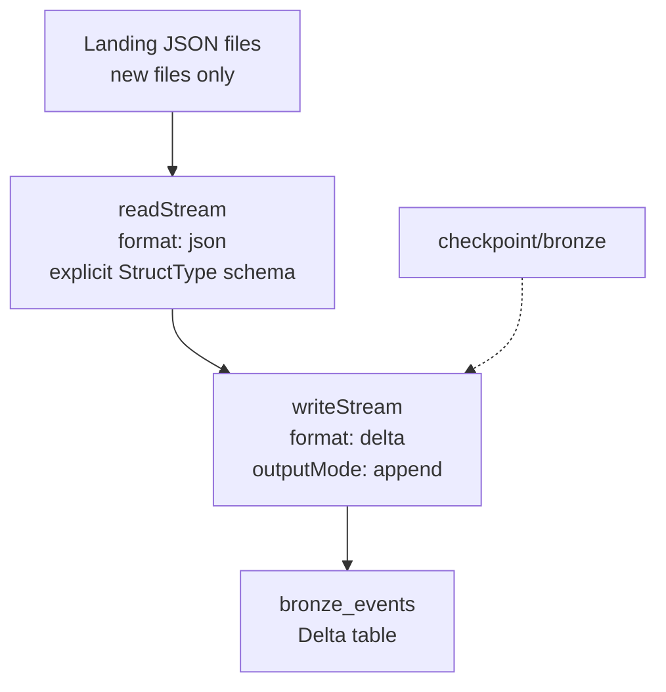

### 15.3 Bronze Configuration

| Setting | Value |
|---|---|
| Source type | File stream (`json`) |
| Source path | `/Volumes/.../smart_factory/landing/` |
| Schema | Explicit `StructType` per REQ-DATA-1 (inference disabled) |
| Sink format | Delta Lake |
| Output mode | `append` |
| Checkpoint | `/Volumes/.../smart_factory/checkpoints/bronze` |
| Trigger | `availableNow=True` (Free Edition) |
| Transformations | **None** |

### 15.4 Bronze Output Schema

| Column | Spark Type | Source | Nullable |
|---|---|---|---|
| `machine_id` | StringType | JSON field | Yes (corrupt events) |
| `temperature` | DoubleType | JSON field | Yes |
| `humidity` | DoubleType | JSON field | Yes |
| `vibration` | DoubleType | JSON field | Yes |
| `status` | StringType | JSON field | Yes |
| `timestamp` | StringType | JSON field | Yes |

### 15.5 Bronze Design Rules

| Rule | Description |
|---|---|
| BRZ-1 | Never filter rows in Bronze |
| BRZ-2 | Never cast types in Bronze |
| BRZ-3 | Always use explicit schema (no inference) |
| BRZ-4 | Always configure checkpoint before first run |
| BRZ-5 | Append only—never overwrite Bronze data |
| BRZ-6 | Corrupt events are first-class citizens in Bronze |

### 15.6 Bronze Operational Notes

| Scenario | Expected Behavior |
|---|---|
| New JSON files uploaded | Next `availableNow` run ingests them |
| Stream restarted | Checkpoint prevents re-processing old files |
| Corrupt JSON (unparseable) | Spark may write null row or fail batch—document in error handling |
| Schema drift (new field) | Extra fields ignored (schema enforced) |

---

## 16. Silver Layer Design

### 16.1 Purpose

Silver is the **cleaned and validated conformed layer**. It applies data quality rules (REQ-DATA-2), enforces types, parses timestamps, and normalizes values. Invalid events are excluded.

### 16.2 Silver Processing Design

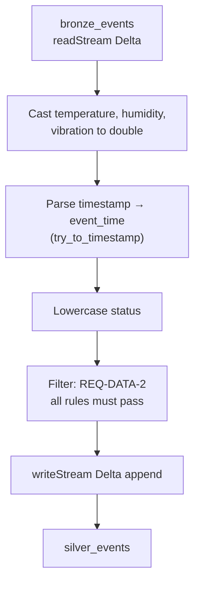

### 16.3 Silver Transformations

| Step | Input Column | Output Column | Logic |
|---|---|---|---|
| 1 | `temperature` | `temperature` | Cast to `double` |
| 2 | `humidity` | `humidity` | Cast to `double` |
| 3 | `vibration` | `vibration` | Cast to `double` |
| 4 | `timestamp` | `event_time` | Parse ISO-8601 to `timestamp` |
| 5 | `status` | `status` | `lower(trim(status))` |
| 6 | All | — | Filter invalid rows (REQ-DATA-2) |
| 7 | `timestamp` | — | Dropped from output (replaced by `event_time`) |

### 16.4 Silver Output Schema

| Column | Spark Type | Nullable | Constraint |
|---|---|---|---|
| `machine_id` | StringType | No | Not null, pattern `machine_\d+` |
| `temperature` | DoubleType | No | -20 to 150 |
| `humidity` | DoubleType | No | 0 to 100 |
| `vibration` | DoubleType | No | 0 to 50 |
| `status` | StringType | No | `running`, `idle`, `error` |
| `event_time` | TimestampType | No | Valid parsed datetime |

### 16.5 Silver Configuration

| Setting | Value |
|---|---|
| Source | `readStream.format("delta").load(BRONZE_TABLE_PATH)` |
| Sink | Delta Lake append |
| Checkpoint | `/Volumes/.../checkpoints/silver` |
| Trigger | `availableNow=True` |
| Rows dropped | All failing REQ-DATA-2 (not written to quarantine in v1) |

### 16.6 Silver vs Bronze Row Count Invariant

```
COUNT(silver_events) < COUNT(bronze_events)
```

When `CORRUPT_RATE = 0.05`, expect approximately 5% fewer Silver rows than Bronze rows over a large sample.

---

## 17. Gold Layer Design

### 17.1 Purpose

Gold is the **business metrics layer**. It aggregates Silver events into per-machine, per-minute summaries including temperature statistics, vibration averages, event counts, error counts, and an overheating alert flag.

### 17.2 Gold Processing Design

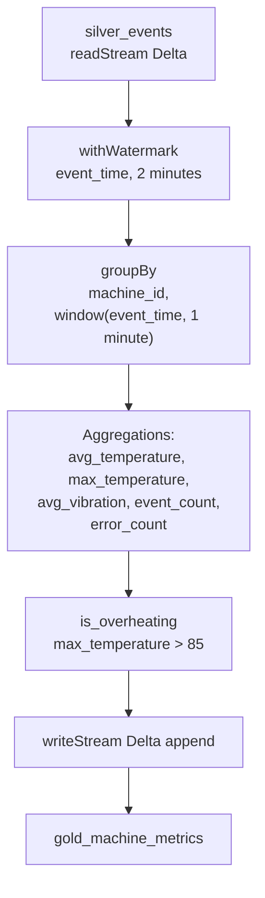

### 17.3 Gold Output Schema

| Column | Spark Type | Description |
|---|---|---|
| `machine_id` | StringType | Machine identifier |
| `window_start` | TimestampType | Start of 1-minute tumbling window |
| `window_end` | TimestampType | End of 1-minute tumbling window |
| `avg_temperature` | DoubleType | Mean temperature in window |
| `max_temperature` | DoubleType | Peak temperature in window |
| `avg_vibration` | DoubleType | Mean vibration in window |
| `event_count` | LongType | Total events in window |
| `error_count` | LongType | Events with `status = 'error'` in window |
| `is_overheating` | BooleanType | `true` when `max_temperature > 85` |

### 17.4 Gold Aggregation Definitions

| Metric | Formula | Business Meaning |
|---|---|---|
| `avg_temperature` | `avg(temperature)` | Typical operating temperature |
| `max_temperature` | `max(temperature)` | Peak temperature (overheating detection) |
| `avg_vibration` | `avg(vibration)` | Mechanical stress indicator |
| `event_count` | `count(*)` | Sensor activity volume |
| `error_count` | `sum(when(status = 'error', 1, 0))` | Machine fault frequency |
| `is_overheating` | `max_temperature > 85` | Boolean alert flag |

### 17.5 Gold Configuration

| Setting | Value |
|---|---|
| Source | Silver Delta stream |
| Watermark | 2 minutes on `event_time` |
| Window | 1-minute tumbling on `event_time` |
| Group by | `machine_id`, `window` |
| Output mode | `append` (Free Edition v1) |
| Checkpoint | `/Volumes/.../checkpoints/gold` |
| Trigger | `availableNow=True` |

### 17.6 Gold Thresholds

| Threshold | Value | Rationale |
|---|---|---|
| Overheating temperature | > 85°C | Demonstration threshold; configurable constant |
| Error status | `status = 'error'` | Direct mapping from producer status field |
| Window size | 1 minute | Balances granularity vs noise for demo |
| Watermark delay | 2 minutes | Allows late events while bounding state |

---

## 18. Streaming Query Flow

### 18.1 Structured Streaming Mental Model

Structured Streaming treats a live data source as an **unbounded table**. Each trigger processes **new data since the last checkpoint** and appends results to the sink.

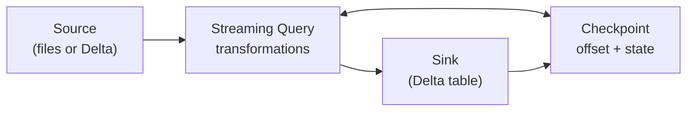

### 18.2 Three Streaming Queries

| Query | Source | Sink | Stateful |
|---|---|---|---|
| Bronze Query | JSON file stream | `bronze_events` | No (stateless append) |
| Silver Query | Bronze Delta stream | `silver_events` | No (stateless append) |
| Gold Query | Silver Delta stream | `gold_machine_metrics` | Yes (watermark + window state) |

### 18.3 Bronze Streaming Query Flow

| Phase | Action |
|---|---|
| 1 — Initialize | Define paths, schema, checkpoint location |
| 2 — Read | `readStream` monitors landing folder for new JSON files |
| 3 — Transform | None (pass-through) |
| 4 — Write | `writeStream` appends to Bronze Delta |
| 5 — Checkpoint | Offset (file list position) committed |
| 6 — Complete | Query terminates after `availableNow` processes all pending files |

### 18.4 Silver Streaming Query Flow

| Phase | Action |
|---|---|
| 1 — Initialize | Load Bronze table path, Silver sink path, checkpoint |
| 2 — Read | `readStream.format("delta")` reads new Bronze commits |
| 3 — Transform | Cast → parse → normalize → filter |
| 4 — Write | Append valid rows to Silver Delta |
| 5 — Checkpoint | Delta source offset committed |
| 6 — Complete | Query terminates |

### 18.5 Gold Streaming Query Flow

| Phase | Action |
|---|---|
| 1 — Initialize | Load Silver path, Gold sink, checkpoint |
| 2 — Read | `readStream.format("delta")` reads new Silver commits |
| 3 — Watermark | `withWatermark("event_time", "2 minutes")` |
| 4 — Aggregate | `groupBy(machine_id, window).agg(...)` |
| 5 — Write | Append windowed rows to Gold Delta |
| 6 — Checkpoint | Offset + aggregation state committed |
| 7 — Complete | Query terminates; late windows may update on subsequent runs (append mode) |

### 18.6 Execution Order (Daily Demo Loop)

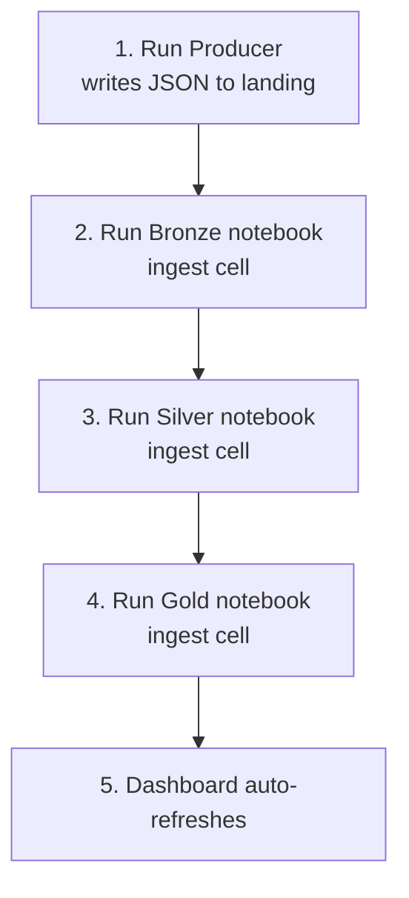

| Step | Prerequisite | Verification Query |
|---|---|---|
| Producer | Volume `landing/` exists | File count increases in Catalog |
| Bronze | Landing has new files | `SELECT COUNT(*) FROM delta.\`...bronze_events\`` |
| Silver | Bronze has new rows | `SELECT COUNT(*) FROM delta.\`...silver_events\`` |
| Gold | Silver has new rows | `SELECT COUNT(*) FROM delta.\`...gold_machine_metrics\`` |
| Dashboard | Gold VIEW exists | Tiles show data |

---

## 19. Event Lifecycle

### 19.1 Lifecycle Stages

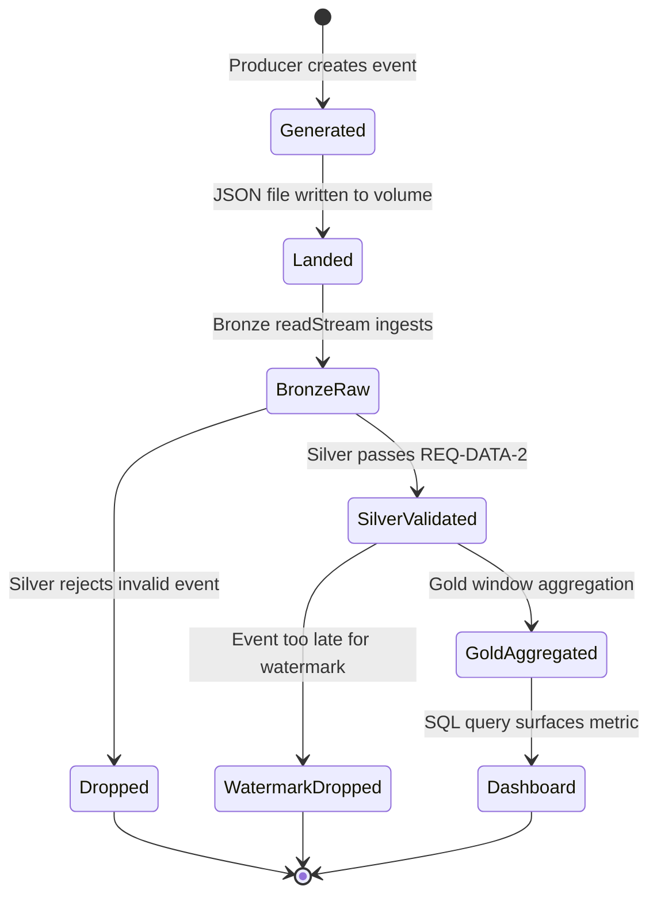

### 19.2 Lifecycle Detail Table

| Stage | State Name | Location | Can Be Recovered |
|---|---|---|---|
| 1 | Generated | Producer memory | No (ephemeral) |
| 2 | Landed | `landing/*.json` | Yes (file on volume) |
| 3 | Bronze Raw | `bronze_events` row | Yes (Delta time travel — future) |
| 4a | Silver Validated | `silver_events` row | Yes |
| 4b | Dropped (invalid) | Nowhere (filtered) | Yes (from Bronze replay) |
| 5a | Gold Aggregated | `gold_machine_metrics` row | Yes |
| 5b | Watermark Dropped | Nowhere (too late) | No (by design) |
| 6 | Dashboard Visible | Query cache | Yes (re-query Gold) |

### 19.3 Valid Event Lifecycle (Happy Path)

| Time | Event |
|---|---|
| T+0s | Producer generates valid event for `machine_03` |
| T+0s | JSON file written to `landing/` |
| T+1m | Operator runs Bronze notebook |
| T+1m | Row appended to `bronze_events` |
| T+2m | Operator runs Silver notebook |
| T+2m | Row appended to `silver_events` with parsed `event_time` |
| T+3m | Operator runs Gold notebook |
| T+3m | Event contributes to its 1-minute window aggregation |
| T+3m | Dashboard shows updated temperature line |

### 19.4 Corrupt Event Lifecycle

| Time | Event |
|---|---|
| T+0s | Producer generates corrupt event (e.g., `temperature = 999`) |
| T+0s | JSON file written to `landing/` |
| T+1m | Bronze ingests corrupt row as-is |
| T+2m | Silver filter rejects row (fails REQ-DATA-2 rule 2) |
| T+2m | Row does **not** appear in `silver_events` |
| T+3m | Gold unaffected (never sees corrupt data) |

### 19.5 Late Event Lifecycle

| Time | Event |
|---|---|
| T+0s | Event generated with `event_time` = 10:00:00 |
| T+4m | Event arrives (late by 4 minutes) |
| T+5m | Gold watermark threshold = 10:03:00 (2-min watermark) |
| T+5m | Event is **dropped** from aggregation (beyond watermark) |

---

## 20. Checkpoint Strategy

### 20.1 Purpose

Checkpoints provide **exactly-once fault tolerance** for Structured Streaming. They store:

- **Source offsets** — which files/rows have been processed
- **Sink progress** — what has been written
- **Stateful operator metadata** — window aggregation state (Gold layer)

### 20.2 Checkpoint Layout

```text
/Volumes/workspace/default/smart_factory/checkpoints/
│
├── bronze/
│   ├── commits/              ← Write transaction log
│   ├── offsets/              ← Source file offsets
│   └── sources/              ← Source-specific metadata
│
├── silver/
│   ├── commits/
│   ├── offsets/
│   └── sources/
│
└── gold/
    ├── commits/
    ├── offsets/
    ├── sources/
    └── state/                ← Window aggregation state (Gold only)
```

### 20.3 Per-Layer Checkpoint Configuration

| Layer | Checkpoint Path | Stores State | Reset Impact |
|---|---|---|---|
| Bronze | `.../checkpoints/bronze` | File offsets | Re-processes all landing files (duplicates in Bronze) |
| Silver | `.../checkpoints/silver` | Delta version offset | Re-processes Bronze (duplicates in Silver) |
| Gold | `.../checkpoints/gold` | Delta offset + window state | Re-processes Silver (duplicate window rows in append mode) |

### 20.4 Checkpoint Rules

| Rule ID | Rule |
|---|---|
| CP-1 | Each streaming query MUST have a unique checkpoint directory |
| CP-2 | Never share checkpoints between Bronze, Silver, and Gold |
| CP-3 | Checkpoint path MUST be on durable storage (Volume, not local driver disk) |
| CP-4 | Deleting a checkpoint forces full reprocessing from source |
| CP-5 | Do not manually edit checkpoint files |
| CP-6 | First run creates checkpoint; subsequent runs resume automatically |

### 20.5 Recovery Scenarios

| Scenario | Action | Expected Result |
|---|---|---|
| Notebook cell interrupted mid-run | Re-run same cell | Resumes from last committed offset; no duplicates |
| Cluster terminated | Re-run notebook | Same as above |
| Checkpoint deleted accidentally | Re-run notebook | Full reprocess; duplicate rows in sink (acceptable for demo) |
| Landing files deleted after ingest | Re-run Bronze | No re-ingest (checkpoint tracks processed files) |
| Bronze table deleted, checkpoint kept | Re-run Bronze | May fail or produce inconsistent state — reset checkpoint |

### 20.6 Checkpoint vs Delta Transaction Log

| Feature | Checkpoint | Delta Log |
|---|---|---|
| Owner | Structured Streaming | Delta Lake |
| Purpose | Stream progress tracking | Table ACID transactions |
| Location | `checkpoints/` | `_delta_log/` inside table dir |
| Reset for replay | Delete checkpoint dir | Use Delta time travel (advanced) |

---

## 21. Delta Table Design

### 21.1 Delta Tables Overview

| Table | Path Suffix | Partitioning | Z-Order | Retention |
|---|---|---|---|---|
| `bronze_events` | `tables/bronze_events` | None (v1) | None | Indefinite (demo) |
| `silver_events` | `tables/silver_events` | None (v1) | None | Indefinite (demo) |
| `gold_machine_metrics` | `tables/gold_machine_metrics` | None (v1) | None | Indefinite (demo) |

### 21.2 Table Properties

| Property | Bronze | Silver | Gold |
|---|---|---|---|
| Format | Delta Lake | Delta Lake | Delta Lake |
| Write mode | Streaming append | Streaming append | Streaming append |
| Read mode | Batch + Stream | Batch + Stream | Batch + SQL |
| Schema enforcement | Explicit on read (Bronze) | Transform-enforced | Aggregation output |
| Primary key | None (v1) | None (v1) | `(machine_id, window_start)` logical |
| Duplicate handling | Checkpoint prevents dupes | Checkpoint prevents dupes | Append may duplicate on replay |

### 21.3 Delta Table File Structure

```text
tables/bronze_events/
├── _delta_log/           ← Transaction log (JSON + checkpoint parquet)
│   ├── 00000000000000000000.json
│   └── ...
└── part-00000-....snappy.parquet   ← Data files
```

### 21.4 SQL Registration Pattern

Because Unity Catalog Volumes do not support `CREATE TABLE ... LOCATION` directly in Free Edition, Gold is exposed to SQL via a **VIEW**:

| Object | Type | Definition |
|---|---|---|
| `workspace.default.gold_machine_metrics` | VIEW | `SELECT * FROM delta.\`/Volumes/.../gold_machine_metrics\`` |

Bronze and Silver are queried directly via `delta.\`path\`` in notebooks or optionally registered as views.

### 21.5 Delta Design Decisions

| Decision | Choice | Rationale |
|---|---|---|
| Path-based tables vs managed tables | Path-based on Volume | Works on Free Edition; portable |
| Partition by `machine_id` | No (v1) | 10 machines — partitioning adds complexity without benefit |
| Optimize / compact schedule | Manual (v1) | Low volume; not needed for demo |
| Change Data Feed | Disabled | Not required for v1 downstream consumers |

### 21.6 Table Growth Projections

| Table | Rows per Hour | Storage per Hour (est.) |
|---|---|---|
| `bronze_events` | 36,000 | ~5 MB |
| `silver_events` | ~34,200 | ~5 MB |
| `gold_machine_metrics` | ~600 | < 1 MB |

---

## 22. Streaming Trigger Strategy

### 22.1 Trigger Options

| Trigger Type | Syntax | Behavior | v1 Usage |
|---|---|---|---|
| **Available Now** | `trigger(availableNow=True)` | Process all available data in one or more batches, then stop | **Primary (Free Edition)** |
| Processing Time | `trigger(processingTime='10 seconds')` | Micro-batch every N seconds | Design target; limited on serverless |
| Once | `trigger(once=True)` | Single micro-batch then stop | Alternative to availableNow |
| Continuous | `trigger(continuous='1 second')` | Low-latency continuous processing | Not available on Free Edition |

### 22.2 v1 Trigger Design

| Layer | Trigger | Rationale |
|---|---|---|
| Bronze | `availableNow=True` | Processes all new landing files in one shot; cost-efficient on serverless |
| Silver | `availableNow=True` | Catches up all new Bronze commits |
| Gold | `availableNow=True` | Catches up all new Silver commits |

### 22.3 Trigger Execution Model

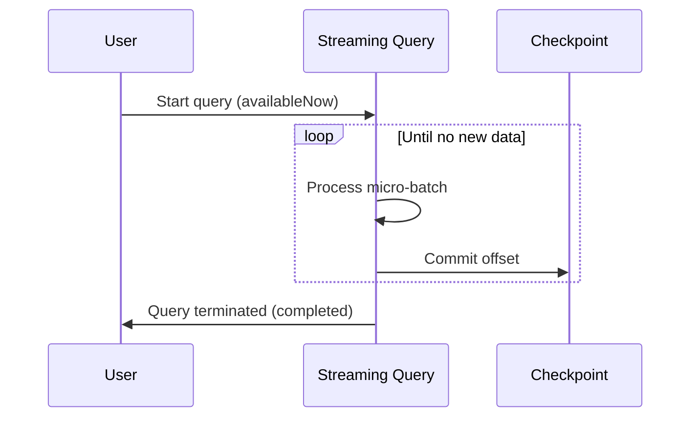

### 22.4 Operational Trigger Workflow

| Activity | Trigger Action |
|---|---|
| New landing files uploaded | Re-run Bronze ingest cell |
| Bronze finished | Re-run Silver ingest cell |
| Silver finished | Re-run Gold ingest cell |
| Dashboard refresh | Automatic (AI/BI setting) or manual |
| Producer running continuously | Re-run Bronze periodically (e.g., every few minutes) |

### 22.5 Future Trigger Design (Production)

| Layer | Production Trigger | Expected Latency |
|---|---|---|
| Bronze | `processingTime='10 seconds')` | ~10–20 seconds |
| Silver | `processingTime='10 seconds')` | ~10–20 seconds |
| Gold | `processingTime='10 seconds')` | ~10–20 seconds |

---

## 23. Watermark Strategy

### 23.1 Purpose

Watermarks bound how long the streaming engine waits for **late-arriving events** before finalizing windowed aggregations. Without watermarks, window state grows unbounded.

### 23.2 Gold Layer Watermark Configuration

| Parameter | Value |
|---|---|
| Column | `event_time` |
| Delay threshold | `2 minutes` |
| Syntax concept | `withWatermark("event_time", "2 minutes")` |
| Applied before | `groupBy` + `window` |

### 23.3 Watermark Behavior

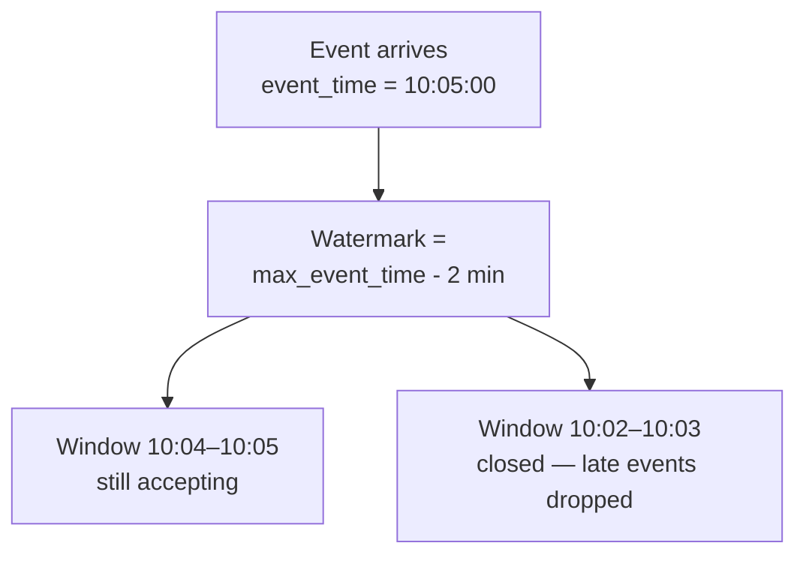

### 23.4 Watermark Rules

| Rule ID | Rule |
|---|---|
| WM-1 | Watermark applies **only** in Gold (stateful aggregation) |
| WM-2 | Bronze and Silver are stateless—no watermark needed |
| WM-3 | Watermark delay (2 min) > window size (1 min) ensures at least one full window of lateness tolerance |
| WM-4 | Events with `event_time` older than watermark are dropped from aggregation |
| WM-5 | Watermark is based on `event_time` (event generation time), not processing time |

### 23.5 Watermark Tuning Guide

| Scenario | Recommended Adjustment |
|---|---|
| More late data tolerance | Increase watermark to 5 minutes |
| Faster dashboard finalization | Decrease watermark to 1 minute (risk dropping late events) |
| Larger windows (5 min) | Set watermark ≥ window size |

### 23.6 Watermark vs Late Data

| Event Arrival | `event_time` | Watermark at Processing Time | Result |
|---|---|---|---|
| On time | 10:05:00 | 10:03:00 | Included in 10:04–10:05 window |
| 1 min late | 10:04:00 (processed 10:06) | 10:04:00 | Included (within 2-min threshold) |
| 3 min late | 10:02:00 (processed 10:06) | 10:04:00 | **Dropped** (before watermark) |

---

## 24. Window Aggregation Strategy

### 24.1 Window Configuration

| Parameter | Value |
|---|---|
| Window type | Tumbling (fixed, non-overlapping) |
| Window duration | 1 minute |
| Window column | `event_time` |
| Group-by keys | `machine_id`, `window(event_time, "1 minute")` |

### 24.2 Tumbling Window Illustration

```text
Timeline (event_time):
|---- Window 1 ----|---- Window 2 ----|---- Window 3 ----|
10:00:00          10:01:00          10:02:00          10:03:00

Events at 10:00:15, 10:00:45 → Window 1
Events at 10:01:10, 10:01:50 → Window 2
```

### 24.3 Aggregation Specification

| Output Column | Aggregation Expression | Type |
|---|---|---|
| `window_start` | `window.start` | Timestamp |
| `window_end` | `window.end` | Timestamp |
| `avg_temperature` | `avg(temperature)` | Double |
| `max_temperature` | `max(temperature)` | Double |
| `avg_vibration` | `avg(vibration)` | Double |
| `event_count` | `count(*)` | Long |
| `error_count` | `sum(when(status = 'error', 1, 0))` | Long |
| `is_overheating` | `max(temperature) > 85` | Boolean |

### 24.4 Expected Gold Row Cardinality

| Condition | Rows per Hour |
|---|---|
| 10 machines, 1-min windows | Up to 600 rows/hour (10 × 60) |
| Machine with no events in window | No row for that machine/window |
| Machine in error entire window | Row with `error_count = event_count` |

### 24.5 Window Design Decisions

| Decision | Choice | Rationale |
|---|---|---|
| Tumbling vs sliding | Tumbling | Simpler to explain; non-overlapping KPIs |
| 1-minute vs 5-minute | 1 minute | More data points on dashboard charts |
| Per-machine grouping | Yes | Operators think per-machine, not factory-wide |
| Hopping window | No (v1) | Adds complexity without demo benefit |

### 24.6 Output Mode Implications

| Mode | Behavior | v1 |
|---|---|---|
| `append` | Only new complete window rows written | **Used** |
| `update` | Update changed rows in sink | Design target (production) |
| `complete` | Rewrite entire result table each trigger | Not appropriate |

With `append` mode on Free Edition, re-running Gold after a checkpoint reset may produce duplicate window rows. Dashboard queries should use `MAX(window_end)` or `ROW_NUMBER` dedup if needed (documented in dashboard SQL).

---

## 25. Data Quality Rules

### 25.1 REQ-DATA-2 — Complete Validation Rules

An event is **valid** if and only if **all** rules pass:

| Rule # | Field | Condition | Invalid Example | Action in Silver |
|---|---|---|---|---|
| DQ-1 | `machine_id` | Not null | `null` | Drop row |
| DQ-2 | `temperature` | Between -20 and 150 (inclusive) | `999` | Drop row |
| DQ-3 | `humidity` | Between 0 and 100 (inclusive) | `-5` | Drop row |
| DQ-4 | `vibration` | Between 0 and 50 (inclusive) | `100` | Drop row |
| DQ-5 | `status` | One of: `running`, `idle`, `error` (case-insensitive after normalization) | `"melting"` | Drop row |
| DQ-6 | `timestamp` | Parses to valid datetime | `"abc"` | Drop row |

### 25.2 Data Quality Enforcement Points

| Layer | Enforcement | Invalid Data Fate |
|---|---|---|
| Producer | Generates ~95% valid, ~5% corrupt (configurable) | Written to landing as-is |
| Bronze | None | Stored raw |
| Silver | REQ-DATA-2 filter | Silently dropped (v1) |
| Gold | Inherits Silver quality | Never sees invalid data |

### 25.3 Data Quality Test Matrix

| Test Case | Input | Expected in Silver |
|---|---|---|
| Valid event | All fields correct | ✓ Present |
| Null `machine_id` | `machine_id = null` | ✗ Absent |
| High temperature | `temperature = 999` | ✗ Absent |
| Low humidity | `humidity = -1` | ✗ Absent |
| High vibration | `vibration = 75` | ✗ Absent |
| Invalid status | `status = "melting"` | ✗ Absent |
| Bad timestamp | `timestamp = "not-a-date"` | ✗ Absent |
| Uppercase status | `status = "RUNNING"` | ✓ Present (normalized to `running`) |

### 25.4 Data Quality Metrics (Manual v1)

| Metric | How to Measure |
|---|---|
| Bronze row count | `SELECT COUNT(*) FROM bronze_events` |
| Silver row count | `SELECT COUNT(*) FROM silver_events` |
| Rejection rate | `1 - (silver_count / bronze_count)` |
| Null check (Silver) | `SELECT COUNT(*) FROM silver_events WHERE machine_id IS NULL` → 0 |

### 25.5 Future Data Quality Enhancements

| Enhancement | Description |
|---|---|
| Quarantine table | Write rejected rows to `silver_rejects` with reason column |
| Great Expectations / DQX | Automated quality test framework |
| Anomaly detection | Statistical outlier flagging beyond range checks |

---

## 26. IoT Event Schema

### 26.1 REQ-DATA-1 — Raw Event Schema

Every IoT event is represented by exactly **six fields**:

| Field | JSON Type | Spark Type (Bronze) | Example | Required |
|---|---|---|---|---|
| `machine_id` | string | StringType | `"machine_03"` | Yes |
| `temperature` | number | DoubleType | `72.4` | Yes |
| `humidity` | number | DoubleType | `45.1` | Yes |
| `vibration` | number | DoubleType | `2.3` | Yes |
| `status` | string | StringType | `"running"` | Yes |
| `timestamp` | string | StringType | `"2026-07-07T15:04:05Z"` | Yes |

### 26.2 Example Valid Event (JSON)

```json
{
  "machine_id": "machine_03",
  "temperature": 72.4,
  "humidity": 45.1,
  "vibration": 2.3,
  "status": "running",
  "timestamp": "2026-07-07T15:04:05Z"
}
```

### 26.3 Schema Design Notes

| Note | Detail |
|---|---|
| `machine_id` pattern | `machine_{NN}` zero-padded (e.g., `machine_01` through `machine_10`) |
| `timestamp` format | ISO-8601 UTC with `Z` suffix |
| Numeric precision | Double precision sufficient for sensor simulation |
| `status` values | Producer weighted distribution: mostly `running`, some `idle`, rare `error` |
| One event per file | Each JSON file contains exactly one JSON object (not an array) |

### 26.4 Corrupt Event Categories (Producer Injection)

| Corruption Type | Field Affected | Purpose |
|---|---|---|
| Null field | Any required field set to `null` | Test DQ-1 and parsing |
| Out-of-range numeric | `temperature`, `humidity`, or `vibration` | Test DQ-2/3/4 |
| Invalid status | `status` set to non-enum value | Test DQ-5 |
| Unparseable timestamp | `timestamp` set to garbage string | Test DQ-6 |

### 26.5 Schema Evolution Policy (v1)

| Change Type | Bronze Behavior | Silver Behavior |
|---|---|---|
| New field added to JSON | Ignored (explicit schema) | N/A |
| Field removed from JSON | Null in Bronze | Dropped by Silver (fails validation) |
| Type change | Stored as-is (may be null) | Cast may fail → dropped |

---

## 27. Data Dictionary

### 27.1 Bronze — `bronze_events`

| # | Column | Data Type | Source | Description | Nullable | Example |
|---|---|---|---|---|---|---|
| 1 | `machine_id` | STRING | `machine_id` | Unique machine identifier | Yes | `machine_03` |
| 2 | `temperature` | DOUBLE | `temperature` | Temperature reading (°C) | Yes | `72.4` |
| 3 | `humidity` | DOUBLE | `humidity` | Relative humidity (%) | Yes | `45.1` |
| 4 | `vibration` | DOUBLE | `vibration` | Vibration level (mm/s) | Yes | `2.3` |
| 5 | `status` | STRING | `status` | Machine operational status | Yes | `running` |
| 6 | `timestamp` | STRING | `timestamp` | Event time as ISO-8601 string | Yes | `2026-07-07T15:04:05Z` |

### 27.2 Silver — `silver_events`

| # | Column | Data Type | Source | Description | Nullable | Example |
|---|---|---|---|---|---|---|
| 1 | `machine_id` | STRING | Bronze `machine_id` | Validated machine identifier | No | `machine_03` |
| 2 | `temperature` | DOUBLE | Bronze `temperature` | Validated temperature (°C) | No | `72.4` |
| 3 | `humidity` | DOUBLE | Bronze `humidity` | Validated humidity (%) | No | `45.1` |
| 4 | `vibration` | DOUBLE | Bronze `vibration` | Validated vibration (mm/s) | No | `2.3` |
| 5 | `status` | STRING | Bronze `status` | Normalized lowercase status | No | `running` |
| 6 | `event_time` | TIMESTAMP | Bronze `timestamp` | Parsed event timestamp | No | `2026-07-07 15:04:05` |

### 27.3 Gold — `gold_machine_metrics`

| # | Column | Data Type | Source | Description | Nullable | Example |
|---|---|---|---|---|---|---|
| 1 | `machine_id` | STRING | Silver `machine_id` | Machine identifier | No | `machine_03` |
| 2 | `window_start` | TIMESTAMP | Window aggregation | Start of 1-min window | No | `2026-07-07 15:04:00` |
| 3 | `window_end` | TIMESTAMP | Window aggregation | End of 1-min window | No | `2026-07-07 15:05:00` |
| 4 | `avg_temperature` | DOUBLE | `avg(temperature)` | Mean temperature in window | Yes | `71.8` |
| 5 | `max_temperature` | DOUBLE | `max(temperature)` | Peak temperature in window | Yes | `78.2` |
| 6 | `avg_vibration` | DOUBLE | `avg(vibration)` | Mean vibration in window | Yes | `2.1` |
| 7 | `event_count` | BIGINT | `count(*)` | Number of events in window | No | `58` |
| 8 | `error_count` | BIGINT | Conditional sum | Count of error-status events | No | `0` |
| 9 | `is_overheating` | BOOLEAN | Derived | `max_temperature > 85` | No | `false` |

### 27.4 Status Code Reference

| Status Value | Meaning | Producer Frequency | Dashboard Impact |
|---|---|---|---|
| `running` | Normal operation | ~85% | Healthy |
| `idle` | Powered on, not producing | ~10% | Informational |
| `error` | Fault condition | ~5% | Increments `error_count`; appears in error tile |

---

## 28. Business Metrics

### 28.1 Metric Catalog

| Metric ID | Metric Name | Formula | Layer | Business Question |
|---|---|---|---|---|
| BM-1 | Average Temperature | `avg(temperature)` per machine per minute | Gold | Is this machine running hot? |
| BM-2 | Maximum Temperature | `max(temperature)` per machine per minute | Gold | Did temperature spike above safe limits? |
| BM-3 | Average Vibration | `avg(vibration)` per machine per minute | Gold | Is mechanical wear increasing? |
| BM-4 | Event Count | `count(*)` per machine per minute | Gold | Is the machine actively reporting? |
| BM-5 | Error Count | `sum(error events)` per machine per minute | Gold | How often is the machine faulting? |
| BM-6 | Overheating Alert | `max_temperature > 85` | Gold | Does this machine need immediate attention? |
| BM-7 | Data Quality Rate | `silver_count / bronze_count` | Silver/Bronze | Is our data trustworthy? |
| BM-8 | Machines in Error | Machines with `error_count > 0` in latest window | Dashboard | Which machines are down right now? |

### 28.2 KPI Thresholds

| KPI | Warning Threshold | Critical Threshold | Source |
|---|---|---|---|
| Max Temperature | > 75°C | > 85°C (`is_overheating`) | Gold |
| Vibration | > 10 mm/s | > 25 mm/s | Silver (future alert) |
| Error Count per minute | > 0 | > 5 | Gold |
| Event Count per minute | < 30 (missing data) | < 10 | Gold |
| Data rejection rate | > 10% | > 20% | Silver/Bronze ratio |

### 28.3 Metric-to-Dashboard Mapping

| Business Metric | Dashboard Tile | Chart Type |
|---|---|---|
| BM-1 Average Temperature | Tile 1 — Temperature Trend | Line chart |
| BM-5 Error Count / BM-8 Machines in Error | Tile 2 — Machines in Error | Table / counter |
| BM-6 Overheating Alert | Tile 3 — Overheating Alerts | Table |
| BM-3 Average Vibration | Tile 4 — Vibration Trend | Line chart |

### 28.4 Metric Computation Frequency

| Metric | Refresh Cadence | Latency |
|---|---|---|
| Gold windowed metrics | Each Gold notebook run | Minutes (demo) |
| Dashboard tiles | Auto-refresh (30–60s) | Minutes |
| Data quality rate | Manual SQL query | On demand |

---

## 29. Dashboard Layout

### 29.1 Dashboard Overview

| Property | Value |
|---|---|
| Dashboard Name | Smart Factory Machine Health |
| Platform | Databricks AI/BI Dashboard |
| Data Source | `workspace.default.gold_machine_metrics` (SQL VIEW) |
| Auto-refresh | Enabled (30–60 second interval) |
| Audience | Factory operators, maintenance engineers |

### 29.2 Dashboard Wireframe

```text
┌─────────────────────────────────────────────────────────────────────┐
│  Smart Factory Machine Health                          [Auto-refresh]│
├──────────────────────────────┬──────────────────────────────────────┤
│                              │                                      │
│  TILE 1: Temperature Trend   │  TILE 2: Machines in Error           │
│  (Line Chart)                │  (Table / Counter)                   │
│                              │                                      │
│  X: window_start             │  machine_id | error_count | window   │
│  Y: avg_temperature          │  machine_07 | 3           | latest   │
│  Series: machine_id          │  machine_09 | 1           | latest   │
│                              │                                      │
├──────────────────────────────┼──────────────────────────────────────┤
│                              │                                      │
│  TILE 3: Overheating Alerts  │  TILE 4: Vibration Trend             │
│  (Table)                     │  (Line Chart)                        │
│                              │                                      │
│  machine_id | max_temp       │  X: window_start                     │
│  machine_02 | 91.3           │  Y: avg_vibration                    │
│  is_overheating = true       │  Series: machine_id                  │
│                              │                                      │
└──────────────────────────────┴──────────────────────────────────────┘
```

### 29.3 Tile Specifications

| Tile # | AC Ref | Title | Visualization | X-Axis | Y-Axis / Values | Filter |
|---|---|---|---|---|---|---|
| 1 | AC-7.2 | Average Temperature by Machine | Line chart | `window_start` | `avg_temperature` | None |
| 1 | AC-7.2 | (series) | Color series | — | — | `machine_id` |
| 2 | AC-7.3 | Machines Currently in Error | Table | — | `machine_id`, `error_count`, `window_end` | Latest `window_end`, `error_count > 0` |
| 3 | AC-7.4 | Overheating Alerts | Table | — | `machine_id`, `max_temperature`, `window_start` | `is_overheating = true` |
| 4 | AC-7.5 | Vibration Trend by Machine | Line chart | `window_start` | `avg_vibration` | None |
| 4 | AC-7.5 | (series) | Color series | — | — | `machine_id` |

### 29.4 SQL Dataset Definitions

| Dataset | Purpose | Key SQL Pattern |
|---|---|---|
| DS-1 Temperature | Tile 1 | `SELECT window_start, machine_id, avg_temperature FROM gold_machine_metrics ORDER BY window_start` |
| DS-2 Errors | Tile 2 | `WITH latest_window AS (SELECT MAX(window_end) ...) SELECT ... WHERE error_count > 0` |
| DS-3 Overheating | Tile 3 | `SELECT ... WHERE is_overheating = true ORDER BY window_start DESC` |
| DS-4 Vibration | Tile 4 | `SELECT window_start, machine_id, avg_vibration FROM gold_machine_metrics ORDER BY window_start` |

Full SQL definitions are maintained in `docs/dashboard_queries.sql`.

### 29.5 Dashboard Setup Steps

| Step | Action |
|---|---|
| 1 | Run VIEW creation SQL in Databricks SQL Editor |
| 2 | Verify: `SELECT COUNT(*) FROM workspace.default.gold_machine_metrics` |
| 3 | Create new AI/BI Dashboard |
| 4 | Add 4 datasets from SQL queries |
| 5 | Configure visualizations per tile specifications |
| 6 | Enable auto-refresh |
| 7 | Capture screenshot for `docs/screenshots/dashboard.png` |

---

## 30. Error Handling Strategy

### 30.1 Error Categories

| Category | Example | Layer | Handling |
|---|---|---|---|
| **E1 — Transient infrastructure** | Cluster timeout, network blip | Any | Re-run notebook cell; checkpoint ensures no data loss |
| **E2 — Unparseable JSON file** | Malformed JSON in landing | Bronze | Spark may skip or write partial row; investigate file |
| **E3 — Schema mismatch** | Extra/missing JSON fields | Bronze | Explicit schema: missing → null; extra → ignored |
| **E4 — Validation failure** | `temperature = 999` | Silver | Row silently filtered (by design) |
| **E5 — Timestamp parse failure** | `timestamp = "abc"` | Silver | `try_to_timestamp` returns null → filtered by DQ-6 |
| **E6 — Late event** | Event beyond watermark | Gold | Dropped from window aggregation |
| **E7 — Checkpoint corruption** | Manual checkpoint edit | Any | Delete checkpoint dir; accept reprocessing |
| **E8 — Missing volume path** | Volume not created | Any | Fail fast with clear path error in config cell |
| **E9 — Empty source** | No new landing files | Bronze | Query completes with 0 new rows (not an error) |

### 30.2 Error Handling by Layer

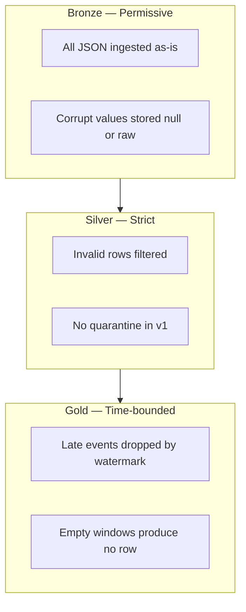

### 30.3 Fail-Fast vs Fail-Safe Decisions

| Situation | Strategy | Rationale |
|---|---|---|
| Missing volume/table path | Fail-fast (notebook error) | Prevents silent writes to wrong location |
| Invalid event data | Fail-safe (Silver filter) | Pipeline continues; bad data excluded |
| Checkpoint missing on first run | Auto-create | Expected behavior |
| Stream query failure mid-batch | Fail-fast (exception) | Checkpoint not committed; safe to retry |
| Producer interrupt (Ctrl+C) | Fail-safe (graceful stop) | Last file not corrupted |

### 30.4 Operator Runbook (Common Errors)

| Error Message / Symptom | Likely Cause | Resolution |
|---|---|---|
| `Path does not exist` | Volume or subfolder not created | Create volume and folder structure per Section 14 |
| `AnalysisException: Table not found` | Delta table not yet written | Run upstream notebook first |
| Bronze count not increasing | No new landing files | Run producer or upload files |
| Silver count = 0 | Bronze empty or all events corrupt | Check Bronze data; verify producer config |
| Gold count = 0 | Silver empty or watermark dropping all | Check Silver data and `event_time` values |
| Dashboard empty | VIEW not created or Gold empty | Run VIEW SQL; verify Gold has rows |
| Duplicate rows after reset | Checkpoint deleted | Expected; document or deduplicate in SQL |

---

## 31. Logging Strategy

### 31.1 Logging Overview (v1)

v1 uses **simple, inspectable logging** appropriate for a beginner portfolio project. No external log aggregation (Datadog, Splunk) in scope.

### 31.2 Logging by Component

| Component | Log Method | What Is Logged | Frequency |
|---|---|---|---|
| Producer notebook | `print()` / Python `logging` | Events written count, machine count, corrupt rate | Every 5 seconds |
| Bronze notebook | `print()` | Source path, sink path, row count after run | Per cell execution |
| Silver notebook | `print()` | Rows processed, schema verification | Per cell execution |
| Gold notebook | `print()` | Windowed row count, sample output | Per cell execution |
| Streaming query | Spark UI (driver logs) | Micro-batch progress, duration | Per micro-batch |
| Dashboard | Databricks audit (platform) | Query execution history | Per refresh |

### 31.3 Producer Logging Contract

| Setting | Default | Log Message Pattern |
|---|---|---|
| `LOG_INTERVAL_SECONDS` | 5 | `"Written {n} events ({rate}/s) — {valid} valid, {corrupt} corrupt"` |

### 31.4 Notebook Verification Output

Each pipeline notebook ends with a **verification cell** that prints:

| Output | Purpose |
|---|---|
| `print(f"Bronze rows: {count}")` | Confirm ingest succeeded |
| `display(df.limit(10))` | Visual sample for screenshots |
| `df.printSchema()` | Confirm schema correctness |

### 31.5 Future Logging Enhancements

| Enhancement | Description |
|---|---|
| Structured JSON logging | Machine-parseable log format |
| Databricks logging library | Centralized driver log shipping |
| Pipeline run ID | Correlate producer → Gold in logs |
| Silver rejection counter | Log count of filtered rows per micro-batch |

---

## 32. Monitoring Strategy

### 32.1 v1 Monitoring Approach

Full observability stacks are out of scope. v1 monitoring relies on **SQL row counts**, **notebook output**, and **dashboard freshness**.

### 32.2 Monitoring Checklist

| Check | Query / Method | Healthy Signal |
|---|---|---|
| Landing file growth | Catalog Explorer file count | Increasing over time |
| Bronze ingest | `SELECT COUNT(*) FROM delta.\`...bronze_events\`` | Monotonically increasing |
| Silver quality | `silver_count / bronze_count` | ~0.95 (with 5% corrupt rate) |
| Gold aggregation | `SELECT COUNT(*) FROM gold_machine_metrics` | > 0 after sufficient runtime |
| Overheating detection | `SELECT * FROM gold WHERE is_overheating` | Returns rows when producer simulates high temp |
| Dashboard freshness | Visual check | Charts update after pipeline re-run |
| Checkpoint existence | Catalog Explorer | `checkpoints/bronze`, `silver`, `gold` dirs exist |

### 32.3 Monitoring Dashboard (Manual SQL)

| Monitor | SQL Concept |
|---|---|
| Pipeline row counts | `UNION ALL` of COUNT from Bronze, Silver, Gold |
| Rejection rate | `1.0 - silver_count / bronze_count` |
| Latest event time | `SELECT MAX(event_time) FROM silver_events` |
| Latest gold window | `SELECT MAX(window_end) FROM gold_machine_metrics` |
| Error machines | `SELECT machine_id, SUM(error_count) FROM gold GROUP BY 1` |

### 32.4 Alerting (v1)

| Alert Type | v1 Mechanism |
|---|---|
| Overheating | Dashboard Tile 3 (visual) |
| Machine error | Dashboard Tile 2 (visual) |
| Pipeline failure | Manual observation of notebook errors |
| Data quality degradation | Manual SQL rejection rate check |

### 32.5 Future Monitoring

| Capability | Tool |
|---|---|
| Streaming query metrics | Spark Structured Streaming UI |
| Pipeline health job | Databricks Workflows |
| Slack alerts | Databricks SQL Alerts |
| Lakehouse Monitoring | Databricks data quality monitoring |

---

## 33. Testing Strategy

### 33.1 Testing Pyramid

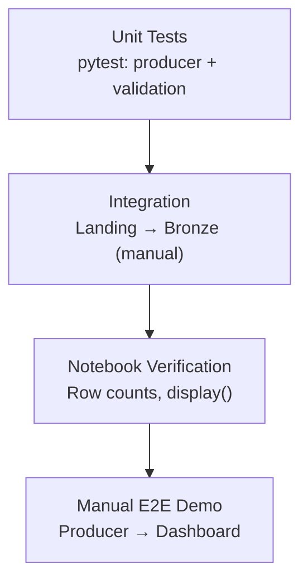

### 33.2 Test Scope by Type

| Test Type | Scope | Tool | Automated |
|---|---|---|---|
| Unit — Producer | Event generation, fields, corrupt rate | `pytest` | Yes |
| Unit — Validation | Each REQ-DATA-2 rule | `pytest` | Yes |
| Notebook smoke | Notebook runs without error | Manual | No |
| Integration | Landing → Bronze → Silver → Gold | Manual | No |
| Dashboard | 4 tiles render with data | Manual | No |
| Checkpoint recovery | Stop/restart stream | Manual | No |
| Watermark | Late event dropped | Manual | No |

### 33.3 Unit Test Matrix

| Test File | Test Count (target) | Coverage |
|---|---|---|
| `tests/test_producer.py` | 14 | Event fields, machine IDs, rate, corrupt injection, graceful stop |
| `tests/test_validation.py` | 13 | Each DQ rule: valid pass + invalid fail |
| **Total** | **27** | Producer + validation contracts |

### 33.4 Validation Test Cases

| Test Name | Input | Expected |
|---|---|---|
| `test_valid_event_passes` | Complete valid event | All rules pass |
| `test_null_machine_id_fails` | `machine_id = None` | DQ-1 fails |
| `test_high_temperature_fails` | `temperature = 999` | DQ-2 fails |
| `test_low_humidity_fails` | `humidity = -1` | DQ-3 fails |
| `test_high_vibration_fails` | `vibration = 100` | DQ-4 fails |
| `test_invalid_status_fails` | `status = "melting"` | DQ-5 fails |
| `test_bad_timestamp_fails` | `timestamp = "abc"` | DQ-6 fails |

### 33.5 Manual E2E Test Procedure

| Step | Action | Pass Criteria |
|---|---|---|
| 1 | Run `pytest -v` locally | 27 tests pass |
| 2 | Run producer for 60 seconds | ~600 JSON files in landing |
| 3 | Upload files to volume (or run Databricks producer) | Files visible in Catalog |
| 4 | Run Bronze notebook | Row count > 0; corrupt rows present |
| 5 | Run Silver notebook | Row count < Bronze; no nulls |
| 6 | Run Gold notebook | Windowed rows present; `is_overheating` works |
| 7 | Open dashboard | All 4 tiles show data |
| 8 | Restart Bronze (no checkpoint delete) | No duplicate rows |
| 9 | Capture screenshots | 4 images in `docs/screenshots/` |

### 33.6 Test Data Strategy

| Data Set | Source | Purpose |
|---|---|---|
| Synthetic valid events | Producer (default) | Happy path |
| Synthetic corrupt events | Producer (`CORRUPT_RATE=0.05`) | Silver filter testing |
| Static sample JSON | Committed sample in docs (optional) | Spark basics notebook |
| High temperature events | Producer config override | Overheating tile testing |

---

## 34. Acceptance Criteria

All acceptance criteria are defined in [SPEC.md](SPEC.md). This section consolidates them for architect review.

### 34.1 Module 1 — Project Setup

| ID | Criterion |
|---|---|
| AC-1.1 | Folder structure: `producer/`, `notebooks/`, `data/landing/`, `tests/`, `docs/`, `.planning/` |
| AC-1.2 | Root files: `requirements.txt`, `.gitignore`, `README.md` |
| AC-1.3 | `.gitignore` excludes `.venv/`, `data/`, `__pycache__/` |
| AC-1.4 | `pip install -r requirements.txt` succeeds |
| AC-1.5 | Repository on GitHub with correct structure |

### 34.2 Module 2 — IoT Producer

| ID | Criterion |
|---|---|
| AC-2.1 | Events conform to REQ-DATA-1 |
| AC-2.2 | One event per machine per second (configurable) |
| AC-2.3 | Machine IDs `machine_01`..`machine_10` (configurable count) |
| AC-2.4 | Each event written as JSON file to landing |
| AC-2.5 | `timestamp` is current UTC ISO-8601 |
| AC-2.6 | `corrupt_rate` injects bad events at configured rate |
| AC-2.7 | Ctrl+C stops gracefully |
| AC-2.8 | Event count logged at regular intervals |

### 34.3 Module 3 — Spark Basics

| ID | Criterion |
|---|---|
| AC-3.1 | Databricks Free Edition workspace accessible |
| AC-3.2 | `spark.range(5).show()` displays 5 rows |
| AC-3.3 | Explicit `StructType` schema (no inference) |
| AC-3.4 | Sample JSON loaded with explicit schema |
| AC-3.5 | Demonstrates `select`, `filter`, `withColumn`, `groupBy().agg()` |
| AC-3.6 | `groupBy("machine_id").count()` returns one row per machine |

### 34.4 Module 4 — Bronze

| ID | Criterion |
|---|---|
| AC-4.1 | `readStream` on new landing JSON files |
| AC-4.2 | Append to `bronze_events` Delta |
| AC-4.3 | No validation, filter, or transform in Bronze |
| AC-4.4 | Checkpoint configured |
| AC-4.5 | Row count increases while producer runs |
| AC-4.6 | Restart resumes without loss or duplication |
| AC-4.7 | Corrupt events stored in Bronze |

### 34.5 Module 5 — Silver

| ID | Criterion |
|---|---|
| AC-5.1 | `readStream` on `bronze_events` |
| AC-5.2 | Cast numerics to double |
| AC-5.3 | Parse `timestamp` → `event_time` |
| AC-5.4 | Lowercase `status` |
| AC-5.5 | Exclude events failing REQ-DATA-2 |
| AC-5.6 | No nulls in Silver required columns |
| AC-5.7 | Corrupt events not in Silver |
| AC-5.8 | Silver count < Bronze count |

### 34.6 Module 6 — Gold

| ID | Criterion |
|---|---|
| AC-6.1 | `readStream` on `silver_events` |
| AC-6.2 | Group by `machine_id` + 1-minute tumbling window |
| AC-6.3 | 2-minute watermark on `event_time` |
| AC-6.4 | Compute `avg_temperature`, `max_temperature`, `avg_vibration`, `event_count`, `error_count` |
| AC-6.5 | `is_overheating = true` when `max_temperature > 85` |
| AC-6.6 | Output includes `window_start`, `window_end` |
| AC-6.7 | `error_count` increases for error-status events |
| AC-6.8 | Late events beyond watermark are dropped |

### 34.7 Module 7 — Dashboard

| ID | Criterion |
|---|---|
| AC-7.1 | Dashboard built on `gold_machine_metrics` |
| AC-7.2 | Line chart: avg temperature per machine over time |
| AC-7.3 | Tile: machines currently in error |
| AC-7.4 | Tile: overheating alerts (`is_overheating = true`) |
| AC-7.5 | Line chart: vibration trend per machine |
| AC-7.6 | Auto-refresh with new pipeline data |

### 34.8 Module 8 — Testing & Documentation

| ID | Criterion |
|---|---|
| AC-8.1 | Producer unit tests (6 fields, corrupt rate) |
| AC-8.2 | Validation tests for each REQ-DATA-2 rule |
| AC-8.3 | `pytest` passes |
| AC-8.4 | README complete with all required sections |
| AC-8.5 | Screenshots in `docs/screenshots/` |
| AC-8.6 | All code committed and pushed to GitHub |

### 34.9 Definition of Done (Project Level)

The project is **complete** when:

1. All 47 acceptance criteria (AC-1.1 through AC-8.6) are verifiably true
2. SDD, SPEC, and ARCHITECTURE documents are committed
3. A live demo can be performed: producer → medallion → dashboard in < 15 minutes
4. Portfolio screenshots are captured and linked in README

---

## 35. Project Milestones

### 35.1 Milestone Timeline

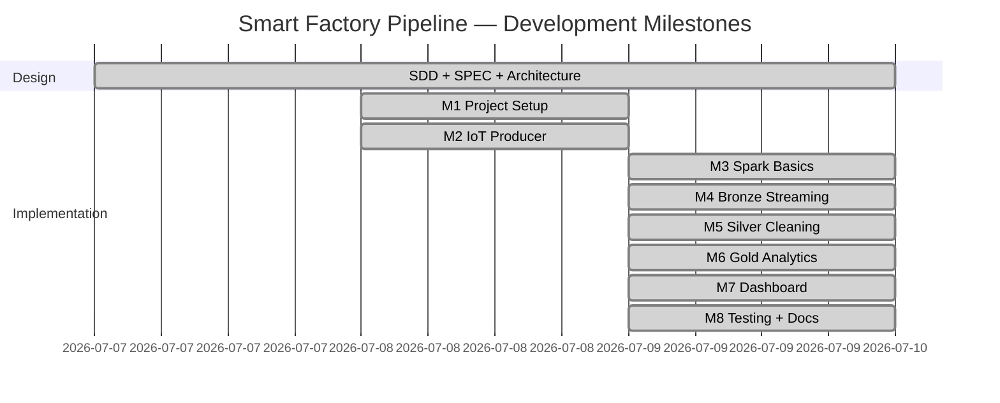

### 35.2 Milestone Summary

| Milestone | Module | Deliverable | Exit Criteria |
|---|---|---|---|
| M0 | Design | SDD, SPEC, ARCHITECTURE | Architect review approved |
| M1 | Project Setup | GitHub repo, folder structure | AC-1.x pass |
| M2 | IoT Producer | `02_producer.py` + `producer/` | AC-2.x pass; events in landing |
| M3 | Spark Basics | `01_spark_basics.py` | AC-3.x pass |
| M4 | Bronze | `03_bronze.py` | AC-4.x pass; `bronze_events` populated |
| M5 | Silver | `04_silver.py` | AC-5.x pass; validated `silver_events` |
| M6 | Gold | `05_gold.py` | AC-6.x pass; windowed metrics |
| M7 | Dashboard | AI/BI Dashboard + SQL | AC-7.x pass; 4 tiles live |
| M8 | Testing & Docs | pytest, README, screenshots | AC-8.x pass; portfolio ready |

### 35.3 Dependencies

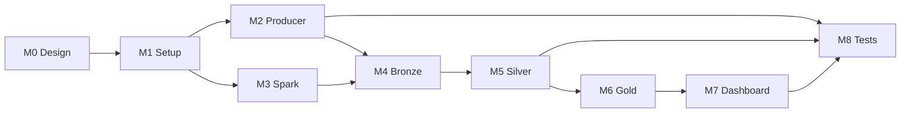

---

## 36. Module-by-Module Development Plan

### 36.1 Module 1 — Project Setup

| Item | Detail |
|---|---|
| **Goal** | Clean repository and environment |
| **Prerequisites** | GitHub account, Python 3.10+ locally for tests |
| **Tasks** | Create repo structure, `.gitignore`, `requirements.txt`, initial README, `.planning/` docs |
| **Concepts** | Git, virtual environments, project organization |
| **Verification** | `pip install` succeeds; folder structure matches Section 12 |
| **Time estimate** | 1–2 hours |

### 36.2 Module 2 — IoT Event Generator

| Item | Detail |
|---|---|
| **Goal** | Continuous realistic event simulation |
| **Prerequisites** | Module 1 complete; Databricks volume `landing/` created |
| **Tasks** | Implement producer notebook; configure machine count, rate, corrupt rate; write JSON to volume |
| **Concepts** | IoT simulation, JSON serialization, configurable producers, graceful shutdown |
| **Verification** | 60s run produces ~600 files; ~5% corrupt; AC-2.x pass |
| **Time estimate** | 2–3 hours |

### 36.3 Module 3 — Databricks Setup and Spark Basics

| Item | Detail |
|---|---|
| **Goal** | Prove PySpark works; learn DataFrame API before streaming |
| **Prerequisites** | Databricks workspace; sample JSON in landing |
| **Tasks** | Import notebook; define explicit schema; batch read JSON; practice transforms |
| **Concepts** | Spark DataFrames, `StructType`, `select`, `filter`, `groupBy` |
| **Verification** | AC-3.x pass; `groupBy("machine_id").count()` shows 10 machines |
| **Time estimate** | 2–3 hours |

### 36.4 Module 4 — Bronze Streaming Layer

| Item | Detail |
|---|---|
| **Goal** | Raw ingest of all events into Delta |
| **Prerequisites** | Landing files exist; volume paths configured |
| **Tasks** | `readStream` JSON with explicit schema; `writeStream` Delta append; checkpoint |
| **Concepts** | Structured Streaming, `readStream`/`writeStream`, checkpoints, append mode |
| **Verification** | AC-4.x pass; corrupt rows visible in Bronze |
| **Time estimate** | 3–4 hours |

### 36.5 Module 5 — Silver Cleaning Layer

| Item | Detail |
|---|---|
| **Goal** | Clean, typed, validated events in Silver |
| **Prerequisites** | Bronze table populated |
| **Tasks** | Stream from Bronze; cast, parse, normalize, filter; write Silver Delta |
| **Concepts** | Streaming transforms, data quality filtering, `try_to_timestamp` |
| **Verification** | AC-5.x pass; Silver < Bronze; no nulls |
| **Time estimate** | 3–4 hours |

### 36.6 Module 6 — Gold Analytics Layer

| Item | Detail |
|---|---|
| **Goal** | Per-machine windowed business metrics |
| **Prerequisites** | Silver table populated |
| **Tasks** | Watermark; 1-min tumbling window; aggregations; overheating flag; write Gold Delta |
| **Concepts** | Watermarks, window aggregations, stateful streaming, KPI derivation |
| **Verification** | AC-6.x pass; `is_overheating` triggers correctly |
| **Time estimate** | 4–5 hours |

### 36.7 Module 7 — Dashboard

| Item | Detail |
|---|---|
| **Goal** | Live machine health visualization |
| **Prerequisites** | Gold table populated; SQL VIEW created |
| **Tasks** | Create VIEW; build 4-tile AI/BI dashboard; enable auto-refresh; screenshot |
| **Concepts** | Databricks SQL, AI/BI dashboards, query datasets |
| **Verification** | AC-7.x pass; all tiles render and update |
| **Time estimate** | 2–3 hours |

### 36.8 Module 8 — Testing and Documentation

| Item | Detail |
|---|---|
| **Goal** | Portfolio-ready quality gate |
| **Prerequisites** | All modules functional |
| **Tasks** | Write pytest suite; complete README; capture screenshots; push to GitHub |
| **Concepts** | Unit testing, documentation, portfolio presentation |
| **Verification** | AC-8.x pass; 27 tests green |
| **Time estimate** | 3–4 hours |

### 36.9 Total Estimated Effort

| Phase | Hours |
|---|---|
| Design (M0) | 4–6 |
| Implementation (M1–M8) | 20–28 |
| **Total** | **24–34 hours** |

---

## 37. Future Improvements

### 37.1 Roadmap

| Priority | Enhancement | Benefit | Complexity |
|---|---|---|---|
| P1 | Kafka / Event Hubs ingestion | Real streaming source; eliminate manual upload | High |
| P1 | `processingTime` continuous triggers | True near-real-time processing | Medium |
| P1 | Gold `outputMode('update')` | Correct upsert semantics for windows | Low |
| P2 | Silver quarantine table | Audit rejected records with rejection reason | Medium |
| P2 | Delta Live Tables (DLT) | Declarative pipeline; built-in quality expectations | Medium |
| P2 | Auto Loader (`cloudFiles`) | Incremental file discovery with schema evolution | Medium |
| P2 | CI/CD with GitHub Actions | Automated pytest on every push | Medium |
| P3 | Databricks SQL Alerts | Slack/email on overheating | Low |
| P3 | ML anomaly detection | Detect unusual vibration patterns | High |
| P3 | Partition pruning on Gold | Performance at scale | Low |
| P3 | Delta time travel | Replay historical pipeline states | Low |
| P3 | Microsoft Fabric comparison | Multi-platform portfolio piece | High |
| P3 | Multi-factory tenancy | `factory_id` column across all layers | Medium |

### 37.2 Architecture Evolution

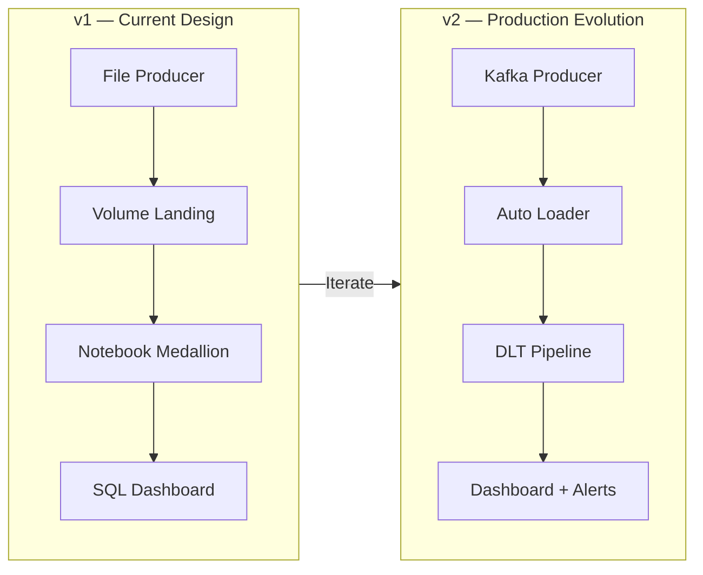

### 37.3 Technical Debt Register

| ID | Item | Impact | Resolution |
|---|---|---|---|
| TD-1 | Manual landing upload | Demo friction | Databricks producer notebook (primary path) |
| TD-2 | `availableNow` trigger | Not truly continuous | Upgrade to paid cluster with `processingTime` |
| TD-3 | Gold append duplicates on replay | Dashboard double-counting | Switch to `update` mode or dedup SQL |
| TD-4 | No quarantine table | Lost visibility into rejects | Add `silver_rejects` in v2 |
| TD-5 | VIEW instead of managed table | Extra SQL setup step | Register tables when UC supports it |

---

## 38. README Outline

The project `README.md` follows this structure:

### 38.1 Required Sections

| # | Section | Content |
|---|---|---|
| 1 | **Title & One-Liner** | Project name + single-sentence description |
| 2 | **Problem Statement** | Why batch is too slow; why streaming matters |
| 3 | **Architecture Diagram** | Mermaid flowchart + link to ARCHITECTURE.md + PNG |
| 4 | **Tech Stack Table** | Python, Databricks, PySpark, Delta, SQL |
| 5 | **Project Structure** | Folder tree with one-line descriptions |
| 6 | **Getting Started (Local)** | venv, pip install, pytest, local producer |
| 7 | **Databricks Pipeline** | Volume paths table, notebook run order |
| 8 | **Free Edition Notes** | `availableNow`, append mode, VIEW registration |
| 9 | **Screenshots** | Table linking to `docs/screenshots/` images |
| 10 | **Build Status** | Module completion table (M1–M8) |
| 11 | **Documentation Links** | SPEC, MASTER_PLAN, ARCHITECTURE, SDD |
| 12 | **Interview One-Liner** | 3–4 sentence elevator pitch |

### 38.2 README Tone Guidelines

| Guideline | Example |
|---|---|
| Beginner-friendly language | "Bronze keeps raw data exactly as received" |
| No jargon without explanation | Define "watermark" on first use |
| Copy-pasteable commands | `python -m producer.generate_events` |
| Visual proof | Screenshots of each layer + dashboard |
| Honest about limitations | "Free Edition uses `availableNow` trigger" |

---

## 39. GitHub Repository Structure

### 39.1 Branch Strategy

| Branch | Purpose |
|---|---|
| `main` | Stable, portfolio-ready code |
| `develop` (optional) | Work-in-progress integration |
| `feature/<module>` (optional) | Per-module development branches |

### 39.2 Repository Configuration

| Setting | Recommendation |
|---|---|
| Visibility | Public (portfolio) |
| Description | "Real-time IoT streaming pipeline with Databricks Structured Streaming and Medallion Architecture" |
| Topics | `databricks`, `pyspark`, `structured-streaming`, `delta-lake`, `medallion-architecture`, `iot`, `data-engineering` |
| License | MIT (recommended for portfolio) |
| `.gitignore` | `.venv/`, `data/`, `__pycache__/`, `.pytest_cache/` |

### 39.3 Commit Convention

| Prefix | Usage | Example |
|---|---|---|
| `feat:` | New module or capability | `feat: add bronze streaming notebook` |
| `fix:` | Bug fix | `fix: silver timestamp parsing for edge case` |
| `docs:` | Documentation only | `docs: add SDD and architecture diagram` |
| `test:` | Test additions | `test: add validation rule tests for DQ-5` |
| `chore:` | Setup, config | `chore: initial project structure` |

### 39.4 Files NOT Committed

| Path | Reason |
|---|---|
| `data/landing/*.json` | Generated runtime data |
| `.venv/` | Local environment |
| `__pycache__/` | Python bytecode |
| Databricks checkpoint internals | Runtime state on volume |
| Secrets / tokens | Security |

### 39.5 GitHub ↔ Databricks Sync

| Method | Description |
|---|---|
| **Databricks Repos** | Connect GitHub repo; notebooks sync bidirectionally |
| **Manual import** | Import `.py` notebook files via Workspace UI |
| **Recommended** | Repos for ongoing development; import for one-time setup |

---

## 40. Demo Walkthrough

### 40.1 Demo Overview

| Property | Value |
|---|---|
| Duration | 10–15 minutes |
| Audience | Interviewer, colleague, or portfolio reviewer |
| Prerequisites | Databricks workspace configured; repo cloned |
| Narrative | "Simulate factory machines → stream through medallion → see live alerts" |

### 40.2 Pre-Demo Checklist

| # | Item | Status |
|---|---|---|
| 1 | Databricks workspace accessible | ☐ |
| 2 | Volume `smart_factory` with subfolders created | ☐ |
| 3 | Notebooks imported | ☐ |
| 4 | SQL VIEW `gold_machine_metrics` created | ☐ |
| 5 | Dashboard built with 4 tiles | ☐ |
| 6 | `pytest` passes locally (27 tests) | ☐ |
| 7 | Browser tab open to dashboard | ☐ |

### 40.3 Demo Script

| Step | Time | Action | What to Say |
|---|---|---|---|
| 1 | 1 min | Show architecture diagram (ARCHITECTURE.md or PNG) | "This is a medallion streaming pipeline: producer → Bronze → Silver → Gold → dashboard." |
| 2 | 1 min | Show GitHub repo structure | "Everything is spec-driven: SDD and SPEC were written before any notebook code." |
| 3 | 2 min | Run `pytest -v` locally | "27 unit tests validate the producer and data quality rules." |
| 4 | 2 min | Run producer notebook (or show pre-loaded landing files) | "10 machines emit one event per second. 5% are intentionally corrupt to test Silver." |
| 5 | 1 min | Show landing files in Catalog Explorer | "Raw JSON files land in a Unity Catalog volume." |
| 6 | 1 min | Run Bronze notebook ingest cell | "Bronze uses Structured Streaming with checkpoints. Notice corrupt events are kept." |
| 7 | 1 min | `SELECT COUNT(*)` on Bronze; `display()` sample | "Bronze is append-only raw ingest—nothing is filtered." |
| 8 | 1 min | Run Silver notebook | "Silver casts types, parses timestamps, and applies six validation rules." |
| 9 | 1 min | Compare Bronze vs Silver counts | "Silver has fewer rows—that's the ~5% corrupt data being filtered out." |
| 10 | 1 min | Run Gold notebook | "Gold applies a 2-minute watermark and 1-minute tumbling windows per machine." |
| 11 | 1 min | Show `is_overheating` rows | "When max temperature exceeds 85°C, the overheating flag is set." |
| 12 | 2 min | Switch to dashboard | "Four tiles: temperature trend, machines in error, overheating alerts, vibration trend." |
| 13 | 1 min | Re-run producer + pipeline; show dashboard update | "The dashboard auto-refreshes as new data flows through." |

### 40.4 Demo Flow Diagram

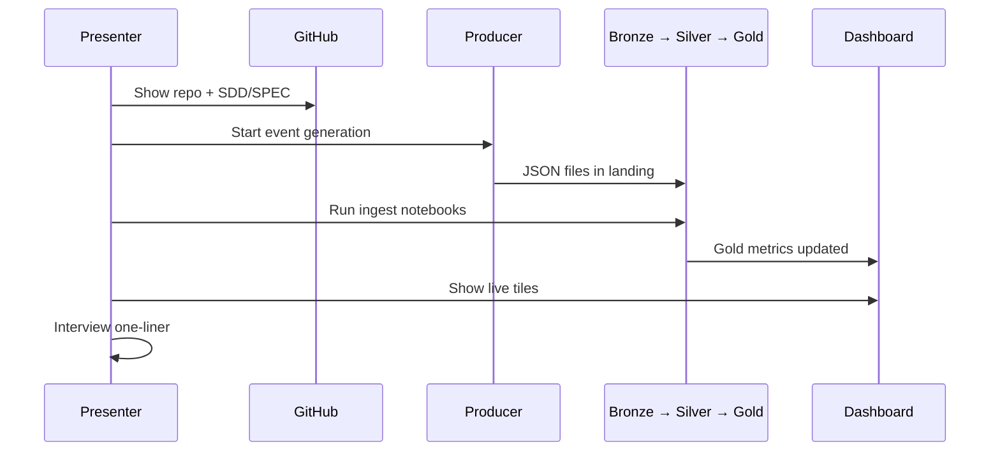

### 40.5 Interview One-Liner

> "I built a real-time IoT streaming pipeline for a smart factory. A Python producer simulates 10 machines sending sensor data every second. I ingest the data into Databricks using Structured Streaming and store it in Delta Lake with a Medallion architecture: Bronze keeps raw events, Silver cleans and validates them, and Gold computes per-minute metrics like average temperature and overheating alerts. A Databricks dashboard shows live machine health. The pipeline uses checkpoints for fault tolerance and watermarks to handle late-arriving data."

### 40.6 Anticipated Questions & Answers

| Question | Answer |
|---|---|
| Why medallion architecture? | Separates raw ingest from quality and analytics; corrupt data is preserved in Bronze for audit while Silver is trusted. |
| Why Structured Streaming over batch? | Machines report every second; batch would delay failure detection by hours. |
| What happens to bad data? | Stored in Bronze, filtered in Silver. v2 would add a quarantine table. |
| What is a watermark? | Tells Spark how long to wait for late events before closing a window. We use 2 minutes. |
| Why `availableNow` instead of continuous? | Databricks Free Edition serverless constraint; processes all pending data efficiently. |
| How do checkpoints work? | They track which files/rows have been processed so restarts don't duplicate or lose data. |
| How would you scale this? | Kafka ingestion, Auto Loader, continuous triggers, partition by date, DLT for orchestration. |
| How do you test a streaming pipeline? | Unit tests for contracts, manual E2E for notebook integration, row count invariants between layers. |

---

## Appendix A — Glossary

| Term | Definition |
|---|---|
| **Structured Streaming** | Spark API treating streams as unbounded tables |
| **Delta Lake** | ACID storage layer on Parquet with transaction log |
| **Medallion Architecture** | Bronze (raw) → Silver (clean) → Gold (metrics) layering |
| **Checkpoint** | Structured Streaming progress store for fault tolerance |
| **Watermark** | Threshold for dropping late events in windowed aggregations |
| **Tumbling Window** | Fixed, non-overlapping time bucket for aggregation |
| **Unity Catalog Volume** | Managed cloud storage path in Databricks |
| **availableNow** | Trigger that processes all pending data then stops |
| **Corrupt Event** | Intentionally invalid event for testing data quality |
| **Landing Zone** | Staging area for raw incoming files before Bronze ingest |

## Appendix B — Document Cross-Reference

| Topic | Primary Document |
|---|---|
| Acceptance criteria | [SPEC.md](SPEC.md) |
| Step-by-step architecture | [ARCHITECTURE.md](ARCHITECTURE.md) |
| Learning walkthrough | [MASTER_PLAN.md](MASTER_PLAN.md) |
| Dashboard SQL | [../docs/dashboard_queries.sql](../docs/dashboard_queries.sql) |
| This SDD | SDD.md (this document) |

## Appendix C — Risk Register

| Risk | Likelihood | Impact | Mitigation |
|---|---|---|---|
| Free Edition compute limits | Medium | Medium | Use `availableNow`; keep machine count at 10 |
| Checkpoint accidental deletion | Low | Medium | Document recovery procedure; don't delete casually |
| Volume path misconfiguration | Medium | High | Centralize paths in `00_config.py` |
| Dashboard empty on demo | Medium | High | Pre-load data; verify VIEW before presenting |
| Schema drift from producer | Low | Low | Explicit schema in Bronze; producer tests |
| Duplicate Gold rows on replay | Medium | Low | Document append mode limitation; dedup in SQL |

---

*End of Software Design Document*

*This document must be reviewed and approved before implementation begins. Implementation shall satisfy every requirement in [SPEC.md](SPEC.md) and conform to the designs specified herein.*
