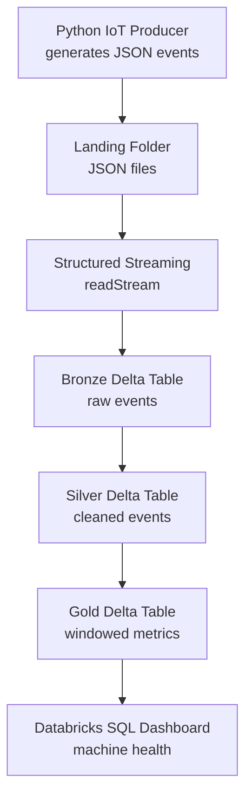

# Smart Factory Streaming Pipeline

Real-time IoT streaming pipeline for a smart factory, built on Databricks Structured Streaming and Delta Lake using a Bronze → Silver → Gold Medallion architecture.

## Problem

A factory has machines with sensors reporting **temperature**, **humidity**, **vibration**, and **status** every second. If a machine overheats or vibrates too much it can break down and stop production. A daily batch report is too slow — problems must be seen **in real time**.

## Architecture



1. **Producer** writes one JSON event per machine per second to `data/landing/`.
2. **Bronze** ingests raw events, unchanged, via Structured Streaming.
3. **Silver** cleans, types, and validates the data.
4. **Gold** computes per-machine, per-minute metrics and alerts.
5. **Dashboard** shows live machine health in Databricks SQL.

## Tech Stack

| Technology | Purpose |
|---|---|
| Python | IoT event producer and tests |
| Databricks Free Edition | Cloud Spark + Delta platform |
| PySpark + Structured Streaming | Continuous processing |
| Delta Lake | Reliable table storage |
| SQL + AI/BI Dashboard | Gold queries and live dashboard |

## Project Structure

```text
smart-factory-streaming-pipeline/
├── producer/
│   ├── generate_events.py    # IoT event simulator
│   ├── config.py             # machine count, rate, paths
│   └── validation.py         # REQ-DATA-2 validation rules
├── notebooks/
│   ├── 01_spark_basics.py    # Module 3 — batch PySpark
│   ├── 03_bronze.py          # Module 4 — Bronze streaming
│   ├── 04_silver.py          # Module 5 — Silver cleaning
│   └── 05_gold.py            # Module 6 — Gold windowed metrics
├── tests/
│   ├── test_producer.py
│   └── test_validation.py
├── docs/
│   ├── dashboard_queries.sql
│   └── screenshots/            # Bronze, Silver, Gold, dashboard images
├── data/landing/               # local JSON output (gitignored)
├── .planning/                  # MASTER_PLAN.md and SPEC.md
├── requirements.txt
└── README.md
```

## Getting Started (local)

```bash
# 1. Create and activate a virtual environment
python -m venv .venv

# Windows
.venv\Scripts\activate

# macOS / Linux
source .venv/bin/activate

# 2. Install dependencies
pip install -r requirements.txt

# 3. Run tests
pytest -v

# 4. Start the IoT producer (Ctrl+C to stop)
python -m producer.generate_events
```

JSON files are written to `data/landing/`. Upload new files to Databricks volume landing for pipeline ingestion.

## Databricks Pipeline

### Paths (Unity Catalog volume)

| Asset | Path |
|---|---|
| Landing | `/Volumes/workspace/default/smart_factory/landing` |
| Bronze table | `/Volumes/workspace/default/smart_factory/tables/bronze_events` |
| Silver table | `/Volumes/workspace/default/smart_factory/tables/silver_events` |
| Gold table | `/Volumes/workspace/default/smart_factory/tables/gold_machine_metrics` |
| Gold SQL view | `workspace.default.gold_machine_metrics` |

### Run order in Databricks

1. Import notebooks from `notebooks/`
2. Upload sample JSON to landing (or producer output)
3. Run `03_bronze.py` ingest cell (`trigger(availableNow=True)`)
4. Run `04_silver.py` ingest cell
5. Run `05_gold.py` ingest cell
6. Create dashboard using queries in `docs/dashboard_queries.sql`

### Free Edition notes

- Use `trigger(availableNow=True)` instead of `processingTime` (serverless limitation)
- Gold Delta writes use `append` mode (not `update`)
- Register Gold for SQL with a VIEW over the Delta path (see `docs/dashboard_queries.sql`)
- Re-run ingest cells when new landing files are uploaded

## Screenshots

Portfolio screenshots live in `docs/screenshots/`:

| Image | Description |
|---|---|
| `bronze_table.png` | Bronze `bronze_events` sample rows |
| `silver_table.png` | Silver `silver_events` cleaned data |
| `gold_table.png` | Gold `gold_machine_metrics` windowed metrics |
| `dashboard.png` | AI/BI machine health dashboard |

See [docs/screenshots/README.md](docs/screenshots/README.md) for capture instructions.

## Build Status

| Module | Status |
|---|---|
| 1 Project Setup | Done |
| 2 IoT Producer | Done |
| 3 Spark Basics | Done |
| 4 Bronze Streaming | Done |
| 5 Silver Cleaning | Done |
| 6 Gold Analytics | Done |
| 7 Dashboard | Done |
| 8 Testing + Docs | Done |

Spec and learning guide: [`.planning/SPEC.md`](.planning/SPEC.md) · [`.planning/MASTER_PLAN.md`](.planning/MASTER_PLAN.md)

## Interview One-Liner

> I built a real-time IoT streaming pipeline for a smart factory. A Python script simulates machines sending sensor data every second. I ingest the data into Databricks using Structured Streaming and store it in Delta Lake with a Medallion architecture: Bronze keeps raw events, Silver cleans and validates them, and Gold computes per-minute metrics like average temperature and overheating alerts. A Databricks dashboard shows live machine health. The pipeline uses checkpoints for fault tolerance and watermarks to handle late-arriving data.
