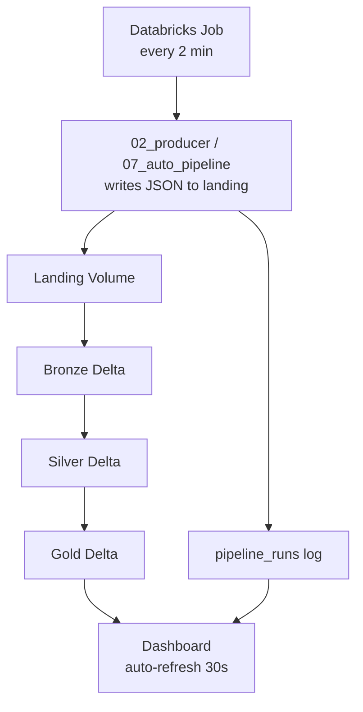

# Smart Factory Streaming Pipeline

Real-time IoT streaming pipeline for a smart factory, built on Databricks Structured Streaming and Delta Lake using a Bronze → Silver → Gold Medallion architecture.

**Fully automated on Databricks** — producer writes to landing volume, scheduled job runs Bronze → Silver → Gold, dashboard auto-refreshes. No manual uploads.

## Problem

A factory has machines with sensors reporting **temperature**, **humidity**, **vibration**, and **status** every second. If a machine overheats or vibrates too much it can break down and stop production. A daily batch report is too slow — problems must be seen **in real time**.

## Architecture

Full step-by-step diagram: **[.planning/ARCHITECTURE.md](.planning/ARCHITECTURE.md)** · 



## Quick Start (Databricks — ~10 min one-time setup)

| Step | Action | Guide |
|---|---|---|
| 1 | Create volume `smart_factory` in Catalog | [JOB_SETUP.md](docs/JOB_SETUP.md) |
| 2 | Import notebooks from GitHub | [JOB_SETUP.md](docs/JOB_SETUP.md) |
| 3 | Run `00_setup.py` once | Creates folders, tables, SQL views |
| 4 | Run `07_auto_pipeline.py` once (test) | Producer → Bronze → Silver → Gold |
| 5 | Schedule `07_auto_pipeline.py` as Job (every 2 min) | [JOB_SETUP.md](docs/JOB_SETUP.md) |
| 6 | Build 6-tile dashboard | [DASHBOARD_SETUP.md](docs/DASHBOARD_SETUP.md) |

After setup: **fully automatic** — no manual uploads, no manual notebook runs.

## Tech Stack

| Technology | Purpose |
|---|---|
| Databricks Free Edition | Cloud Spark + Delta + Jobs + Dashboard |
| PySpark + Structured Streaming | Medallion streaming layers |
| Delta Lake | Bronze, Silver, Gold, pipeline_runs tables |
| Unity Catalog Volumes | Landing + table storage |
| AI/BI Dashboard | 6 auto-refreshing visualizations |
| GitHub | Version control for notebooks |

## Project Structure

```text
smart-factory-streaming-pipeline/
├── notebooks/
│   ├── 00_config.py            # Shared paths and constants
│   ├── 00_setup.py             # One-time volume + views setup
│   ├── 01_spark_basics.py      # Batch PySpark learning
│   ├── 02_producer.py          # IoT producer → landing volume
│   ├── 03_bronze.py            # Bronze streaming (individual)
│   ├── 04_silver.py            # Silver streaming (individual)
│   ├── 05_gold.py              # Gold streaming (individual)
│   ├── 06_run_pipeline.py      # Manual pipeline runner
│   └── 07_auto_pipeline.py     # ★ Automated pipeline (schedule this)
├── producer/                   # Local producer + tests
├── docs/
│   ├── JOB_SETUP.md            # Schedule automated pipeline
│   ├── DASHBOARD_SETUP.md      # Build 6-tile dashboard
│   └── dashboard_queries.sql   # Dashboard SQL queries
├── tests/
└── .planning/                  # SDD, SPEC, ARCHITECTURE
```

## Databricks Paths

| Asset | Path |
|---|---|
| Landing | `/Volumes/workspace/default/smart_factory/landing` |
| Bronze | `/Volumes/workspace/default/smart_factory/tables/bronze_events` |
| Silver | `/Volumes/workspace/default/smart_factory/tables/silver_events` |
| Gold | `/Volumes/workspace/default/smart_factory/tables/gold_machine_metrics` |
| Pipeline log | `/Volumes/workspace/default/smart_factory/tables/pipeline_runs` |
| SQL views | `workspace.default.pipeline_health`, `.pipeline_runs`, etc. |

## Dashboard (6 tiles — auto-updating)

| Tile | What it shows |
|---|---|
| 1 — Pipeline Flow | Landing → Bronze → Silver → Gold row counts + what happens |
| 2 — Quality Funnel | Raw vs valid vs rejected (bar chart) |
| 3 — Ingestion Activity | Events per minute (line chart) |
| 4 — Temperature Trend | Avg temperature per machine |
| 5 — Health Alerts | Overheating + error machines |
| 6 — Pipeline Run History | Row counts growing over time per job run |

## Local Development (tests only)

```bash
python -m venv .venv
.venv\Scripts\activate        # Windows
pip install -r requirements.txt
pytest -v
```

Local producer (`python -m producer.generate_events`) is for unit tests only. The **Databricks pipeline is fully automatic**.

## Free Edition Notes

- `trigger(availableNow=True)` — processes all pending data per job run
- Schedule Job every 2–5 minutes for near-real-time updates
- Gold uses `append` mode; SQL VIEWs for dashboard access

## Interview One-Liner

> I built an automated IoT streaming pipeline on Databricks. A scheduled job simulates 10 factory machines, writes JSON directly to a Unity Catalog volume, and runs Structured Streaming through Bronze, Silver, and Gold Delta tables with checkpoints and watermarks. Each run is logged to a pipeline_runs table. An AI/BI dashboard with 6 tiles auto-refreshes to show data flow, quality funnel, ingestion rate, temperature trends, alerts, and pipeline growth over time — no manual uploads.

## Documentation

- [JOB_SETUP.md](docs/JOB_SETUP.md) — Schedule the automated pipeline
- [DASHBOARD_SETUP.md](docs/DASHBOARD_SETUP.md) — Build the dashboard
- [SPEC.md](.planning/SPEC.md) · [SDD.md](.planning/SDD.md) · [ARCHITECTURE.md](.planning/ARCHITECTURE.md)
