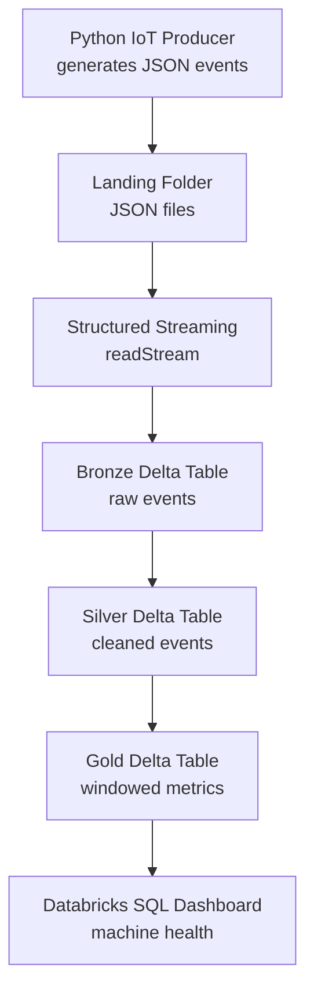

# Smart Factory Streaming Pipeline

Real-time IoT streaming pipeline for a smart factory, built on Databricks Structured Streaming and Delta Lake using a Bronze → Silver → Gold Medallion architecture.

## Problem

A factory has machines with sensors reporting **temperature**, **humidity**, **vibration**, and **status** every second. If a machine overheats or vibrates too much it can break down and stop production. A daily batch report is too slow — problems must be seen **in real time**.

## Architecture



1. **Producer** writes one JSON event per machine per second to `data/landing/`.
2. **Bronze** ingests raw events, unchanged, via Structured Streaming.
3. **Silver** cleans, types, and validates the data.
4. **Gold** computes per-machine, per-minute metrics and alerts.
5. **Dashboard** shows live machine health in Databricks SQL.

## Tech Stack

| Technology | Purpose |
|---|---|
| Python | IoT event producer and tests |
| Databricks Free Edition | Cloud Spark + Delta platform |
| PySpark + Structured Streaming | Continuous processing |
| Delta Lake | Reliable table storage |
| SQL | Gold queries and dashboard |

## Project Structure

```text
smart-factory-streaming-pipeline/
├── producer/          # IoT event simulator
├── notebooks/         # Bronze / Silver / Gold + Spark basics
├── data/landing/      # JSON files from producer (gitignored)
├── tests/             # Producer + validation tests
├── docs/screenshots/  # Diagrams and dashboard screenshots
├── config/            # Shared configuration
├── .planning/         # MASTER_PLAN.md and SPEC.md
├── requirements.txt
├── README.md
└── .gitignore
```

## Getting Started

```bash
# 1. Create and activate a virtual environment
python -m venv .venv
# Windows
.venv\Scripts\activate
# macOS / Linux
source .venv/bin/activate

# 2. Install dependencies
pip install -r requirements.txt
```

## Build Order

This project is built one module at a time. See [`.planning/MASTER_PLAN.md`](.planning/MASTER_PLAN.md) for the learning guide and [`.planning/SPEC.md`](.planning/SPEC.md) for the acceptance criteria.

1. **Module 1 — Project Setup** ✅ (this repo structure)
2. Module 2 — Python IoT Event Generator
3. Module 3 — Databricks Setup and Spark Basics
4. Module 4 — Bronze Streaming Layer
5. Module 5 — Silver Cleaning Layer
6. Module 6 — Gold Analytics Layer
7. Module 7 — Dashboard
8. Module 8 — Testing and Documentation
